# Fascinator System - Architecture Diagrams

This document contains comprehensive Mermaid diagrams explaining the proposed Fascinator system architecture, data flows, and operational workflows.

---

## 1. HIGH-LEVEL SYSTEM ARCHITECTURE

```mermaid
graph TB
    subgraph External["External Sources"]
        WEB[("🌐 Web<br/>Domains")]
    end

    subgraph Ingestion["Ingestion Layer"]
        RC["Rust Crawler<br/>High Performance"]
        GC["Go Crawler<br/>Concurrent"]
        CF["Crawl Frontier<br/>Priority Queue"]

        RC --> CF
        GC --> CF
        WEB --> RC
        WEB --> GC
    end

    subgraph Storage["Storage Layer"]
        RAW[("📦 Raw Storage<br/>ZFS Dataset<br/>2TB NVMe")]
        PROC[("📄 Processed<br/>Parquet<br/>2TB NVMe")]
        ARCH[("🗄️ Archive<br/>Cold Storage")]
    end

    subgraph Processing["Processing Layer"]
        TIKA["Apache Tika<br/>Service"]
        NLP["NLP Pipeline<br/>spaCy/NLTK"]
        EMBED["Embedding Gen<br/>sentence-transformers"]
        TOPIC["Topic Modeling<br/>Gensim/LDA"]
    end

    subgraph Database["Database Layer"]
        PG[("🐘 PostgreSQL<br/>+pgvector")]
        REDIS[("⚡ Redis<br/>Cache + Queues")]
    end

    subgraph Intelligence["Intelligence Layer"]
        ICM["ICM Module<br/>Curiosity Engine"]
        SCORE["URL Scorer"]
        EVICT["Document Evictor"]
        CLUSTER["Clusterer<br/>scikit-learn"]
    end

    subgraph Orchestration["Orchestration Layer"]
        MQ["Message Queue<br/>RabbitMQ/Kafka"]
        WORK["Workflow Engine<br/>Airflow"]
        SCHED["Scheduler"]
    end

    subgraph API["API Layer"]
        REST["REST API<br/>FastAPI"]
        DASH["Admin Dashboard<br/>React"]
        CLI["CLI Tool"]
    end

    subgraph Monitoring["Monitoring Layer"]
        PROM["Prometheus"]
        GRAF["Grafana"]
        ELK["ELK Stack"]
        ALERT["Alertmanager"]
    end

    %% Flows
    CF --> RAW
    RAW --> TIKA
    TIKA --> NLP
    NLP --> EMBED
    NLP --> TOPIC
    TOPIC --> PG
    EMBED --> PG
    PROC --> PG

    PG --> ICM
    REDIS --> ICM
    ICM --> SCORE
    ICM --> EVICT
    ICM --> CLUSTER

    SCORE --> CF
    EVICT --> ARCH
    CLUSTER --> PG

    MQ --> RC
    MQ --> GC
    MQ --> TIKA
    MQ --> ICM

    WORK --> SCHED
    SCHED --> MQ

    REST --> PG
    REST --> REDIS
    DASH --> REST
    CLI --> REST

    PROM --> GRAF
    ELK --> ALERT

    classDef storage fill:#e1f5ff,stroke:#0288d1,stroke-width:2px
    classDef processing fill:#fff3e0,stroke:#f57c00,stroke-width:2px
    classDef intelligence fill:#f3e5f5,stroke:#7b1fa2,stroke-width:2px
    classDef api fill:#e8f5e9,stroke:#388e3c,stroke-width:2px

    class RAW,PROC,ARCH,PG,REDIS storage
    class TIKA,NLP,EMBED,TOPIC processing
    class ICM,SCORE,EVICT,CLUSTER intelligence
    class REST,DASH,CLI api
```

---

## 2. DETAILED DATA FLOW PIPELINE

---

## 3. ICM (INTRINSIC CURIOSITY MODULE) DETAILED WORKFLOW

```mermaid
flowchart TB
    subgraph Input["Input Layer"]
        DOC[New Document]
        DOCMETA[Document Metadata<br/>URL, Domain, Timestamp]
    end

    subgraph FeatureExtraction["Feature Extraction"]
        EMBED1[Embedding Generator<br/>sentence-transformers]
        META1[Metadata Encoder<br/>Domain, Type, Depth]
        DOC --> EMBED1
        DOCMETA --> META1
    end

    subgraph StateRepresentation["State Representation"]
        CONCAT1[Concatenate Features]
        EMBED1 --> CONCAT1
        META1 --> CONCAT1

        STATE[State Vector s_t<br/>Dimension: 768]
        CONCAT1 --> STATE
    end

    subgraph HistoricalContext["Historical Context"]
        PGQUERY[Query pgvector<br/>for Similar Docs]
        STATE --> PGQUERY

        NEIGHBORS[K-Nearest Neighbors<br/>Previously Seen]
        PGQUERY --> NEIGHBORS

        PREVSTATE[Previous State s_t-1]
        NEIGHBORS --> PREVSTATE
    end

    subgraph ICMCore["ICM Core Models"]
        direction TB

        subgraph InverseModel["Inverse Model"]
            INV_IN["Input: [s_t-1, s_t]"]
            INV_NET["Neural Network<br/>3 Dense Layers"]
            INV_OUT["Output: â_t<br/>Predicted Action"]

            INV_IN --> INV_NET --> INV_OUT
        end

        subgraph ForwardModel["Forward Model"]
            FWD_IN["Input: [s_t-1, a_t]"]
            FWD_NET["Neural Network<br/>3 Dense Layers"]
            FWD_OUT["Output: ŝ_t<br/>Predicted Next State"]

            FWD_IN --> FWD_NET --> FWD_OUT
        end

        STATE --> INV_IN
        PREVSTATE --> INV_IN
        PREVSTATE --> FWD_IN

        ACTION[Actual Action a_t<br/>URL followed, domain explored]
        ACTION --> FWD_IN
    end

    subgraph Reward["Intrinsic Reward Computation"]
        DIFF["Prediction Error<br/>||ŝ_t - s_t||²"]
        STATE --> DIFF
        FWD_OUT --> DIFF

        SCALE["Scale by η<br/>Learning Rate"]
        DIFF --> SCALE

        INTRINSIC["Intrinsic Reward r_i<br/>Novelty Score"]
        SCALE --> INTRINSIC
    end

    subgraph Scoring["Document & URL Scoring"]
        DOCSCORE["Document Score<br/>= r_i × importance"]
        INTRINSIC --> DOCSCORE

        THRESHOLD{Score ><br/>Threshold?}
        DOCSCORE --> THRESHOLD

        KEEP["✓ Keep Document<br/>High Novelty"]
        EVICT["✗ Evict Document<br/>Low Novelty"]

        THRESHOLD -->|Yes| KEEP
        THRESHOLD -->|No| EVICT
    end

    subgraph URLExtraction["URL Curiosity Scoring"]
        EXTRACT["Extract URLs<br/>from Document"]
        KEEP --> EXTRACT

        URLFEATURES["URL Features<br/>Domain, TLD, Path Depth"]
        EXTRACT --> URLFEATURES

        URLPREDICT["Predict Future<br/>Curiosity Score"]
        URLFEATURES --> URLPREDICT
        STATE --> URLPREDICT

        URLRANK["Rank URLs by<br/>Predicted Curiosity"]
        URLPREDICT --> URLRANK
    end

    subgraph Output["Output Actions"]
        CACHE["Cache High-Score<br/>URLs in Redis"]
        URLRANK --> CACHE

        QUEUE["Add to Crawl<br/>Priority Queue"]
        CACHE --> QUEUE

        ARCHIVE["Move Low-Score<br/>Docs to Archive"]
        EVICT --> ARCHIVE

        UPDATE["Update ICM<br/>Model Weights"]
        INTRINSIC --> UPDATE
    end

    subgraph Feedback["Feedback Loop"]
        RETRAIN["Periodic<br/>Retraining"]
        UPDATE --> RETRAIN

        METRICS["Track Metrics<br/>Exploration Rate<br/>Diversity Score"]
        RETRAIN --> METRICS

        ADJUST["Adjust<br/>Hyperparameters"]
        METRICS --> ADJUST

        ADJUST -.->|Update| ICMCore
    end

    style ICMCore fill:#e1bee7,stroke:#8e24aa,stroke-width:3px
    style InverseModel fill:#fff9c4,stroke:#f57f17,stroke-width:2px
    style ForwardModel fill:#ffccbc,stroke:#d84315,stroke-width:2px
    style INTRINSIC fill:#c5e1a5,stroke:#558b2f,stroke-width:3px
    style KEEP fill:#81c784,stroke:#388e3c,stroke-width:2px
    style EVICT fill:#e57373,stroke:#c62828,stroke-width:2px
```

---

## 4. MESSAGE QUEUE ARCHITECTURE

---

## 5. DATABASE SCHEMA & RELATIONSHIPS

---

## 6. KUBERNETES DEPLOYMENT ARCHITECTURE

---

## 7. CI/CD PIPELINE

```mermaid
flowchart LR
    subgraph Developer["Developer Workflow"]
        CODE["Write Code"]
        COMMIT["Git Commit"]
        PUSH["Git Push"]
        PR["Create Pull Request"]

        CODE --> COMMIT --> PUSH --> PR
    end

    subgraph CI["Continuous Integration (GitHub Actions)"]
        TRIGGER["Trigger: PR/Push"]

        subgraph Tests["Test Stage"]
            LINT["Linting<br/>pylint, black, mypy"]
            UNIT["Unit Tests<br/>pytest"]
            SECURITY["Security Scan<br/>bandit, safety"]

            LINT -.-> UNIT -.-> SECURITY
        end

        subgraph Build["Build Stage"]
            DOCKER["Build Docker Images"]
            SCAN["Image Scanning<br/>Trivy"]
            PUSH_REG["Push to Registry"]

            DOCKER --> SCAN --> PUSH_REG
        end

        TRIGGER --> Tests
        Tests -->|Pass| Build
        Tests -->|Fail| NOTIFY1["Notify Failure"]
    end

    subgraph CD_Staging["CD: Staging Environment"]
        DEPLOY_STG["Deploy to Staging"]

        subgraph Integration["Integration Tests"]
            E2E["End-to-End Tests"]
            LOAD["Load Tests<br/>Locust"]
            PERF["Performance Tests"]

            E2E --> LOAD --> PERF
        end

        HEALTH_STG["Health Checks"]
        SMOKE["Smoke Tests"]

        DEPLOY_STG --> Integration
        Integration --> HEALTH_STG --> SMOKE
    end

    subgraph Approval["Manual Approval"]
        REVIEW["Human Review"]
        APPROVE["Approve Deploy"]

        REVIEW --> APPROVE
    end

    subgraph CD_Prod["CD: Production Environment"]
        BACKUP["Backup Current State"]

        subgraph Deploy["Deployment Strategy"]
            BLUE["Blue-Green Deploy"]
            CANARY["Canary Release<br/>5% → 50% → 100%"]

            BLUE -.Alternative.- CANARY
        end

        MIGRATE["Run Migrations"]
        HEALTH_PROD["Health Checks"]

        BACKUP --> Deploy
        Deploy --> MIGRATE --> HEALTH_PROD
    end

    subgraph Monitoring["Post-Deploy Monitoring"]
        METRICS["Monitor Metrics<br/>5 minutes"]
        ERROR["Error Rate Check"]
        LATENCY["Latency Check"]

        METRICS --> ERROR
        METRICS --> LATENCY
    end

    subgraph Rollback["Automatic Rollback"]
        DETECT["Detect Issues"]
        REVERT["Revert to Previous"]
        NOTIFY2["Alert Team"]

        DETECT --> REVERT --> NOTIFY2
    end

    %% Flow
    PR --> TRIGGER
    Build -->|Success| DEPLOY_STG
    SMOKE -->|Pass| REVIEW
    SMOKE -->|Fail| NOTIFY1
    APPROVE --> BACKUP
    HEALTH_PROD --> METRICS
    ERROR -->|High| DETECT
    LATENCY -->|High| DETECT
    ERROR -->|Normal| SUCCESS["✓ Deploy Complete"]
    LATENCY -->|Normal| SUCCESS

    style SUCCESS fill:#4caf50,stroke:#2e7d32,color:#fff,stroke-width:3px
    style NOTIFY1 fill:#f44336,stroke:#c62828,color:#fff,stroke-width:2px
    style NOTIFY2 fill:#f44336,stroke:#c62828,color:#fff,stroke-width:2px
    style APPROVE fill:#2196f3,stroke:#1565c0,color:#fff,stroke-width:2px
```

---

## 8. MONITORING & ALERTING ARCHITECTURE

---

## 9. CURIOSITY-DRIVEN EXPLORATION STATES

---

## 10. TOPIC MODEL EVOLUTION TRACKING

---

## 11. SECURITY ARCHITECTURE

---

## 12. SCALING STRATEGY

---

## Summary

These diagrams provide a comprehensive view of the proposed Fascinator system:

1. **High-Level Architecture**: Complete system overview with all layers
2. **Data Flow Pipeline**: Detailed step-by-step data processing
3. **ICM Workflow**: In-depth curiosity module operations
4. **Message Queue**: Task distribution architecture
5. **Database Schema**: Complete data model with relationships
6. **Kubernetes Deployment**: Production infrastructure
7. **CI/CD Pipeline**: Automated testing and deployment
8. **Monitoring**: Observability and alerting
9. **State Machine**: Curiosity-driven exploration states
10. **Topic Evolution**: Tracking content changes over time
11. **Security**: Comprehensive security layers
12. **Scaling**: Horizontal and vertical scaling strategies

Each diagram can be rendered using Mermaid-compatible tools (GitHub, GitLab, Mermaid Live Editor, etc.).
