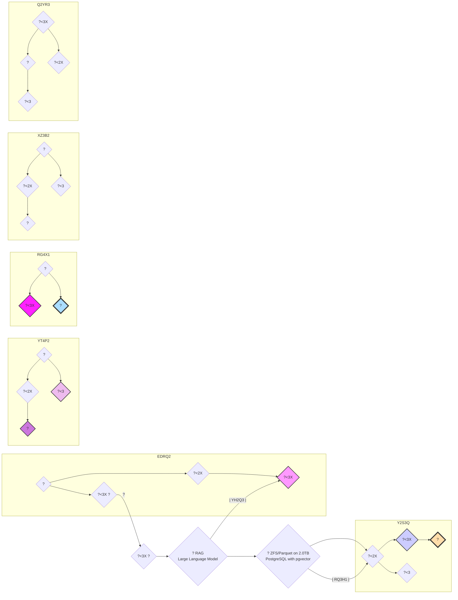

# fascinator
An advanced data processing and clustering solution utilizing web crawling, natural language processing, machine learning, and database management.

project_root/
├── crawlers/       # Your existing web crawlers 
├── ingest/
│   ├── tika/       # Apache Tika installation (jar files, configuration)
│   └── post_processing.py  # Python script for cleaning, filtering, and eviction (using Redis)
├── topic_model/
│   ├── models/    # Directory to store trained topic models
│   └── divergence_scores.py  # Python script to calculate divergence scores (using pgvector)
├── clustering/
│   └── clustering.py # Python script for unsupervised clustering (using pgvector and scikit-learn)
├── novelty/
│   └── novelty_scoring.py # Python script for novelty score calculation
├── monitoring/
│   └── monitor.py # Python script for monitoring system performance and gathering feedback
├── data/
│   ├── raw/        # ZFS-formatted for raw crawled data
│   ├── processed/  # Parquet-formatted for processed documents
│   └── postgresql/  # PostgreSQL data directory (including pgvector extension)
