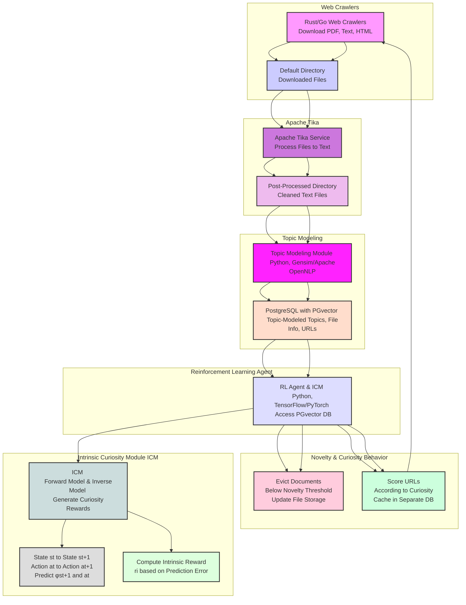

To integrate the Intrinsic Curiosity Module (ICM) with the fascinator software stack for NLP tasks, we need to clearly depict the flow of data and the interaction between components. This includes the web crawlers, Apache Tika service, topic modeling module, PostgreSQL database with PGvector, and the reinforcement learning agent that uses the ICM for curiosity-driven exploration. The ICM will influence the crawling behavior based on novelty and curiosity, and will handle document eviction based on novelty scores.

Here’s the updated Mermaid diagram:

### Explanation:

1. **Web Crawlers:**
   - Rust/Go web crawlers download various file types and save them to a default directory.

2. **Apache Tika:**
   - The Apache Tika service processes the downloaded files, converting them to cleaned text files stored in a post-processed directory.

3. **Topic Modeling:**
   - The topic modeling module (using Python, Gensim, or Apache OpenNLP) processes the cleaned text files to extract topics and stores the results in the PostgreSQL database with PGvector.

4. **Reinforcement Learning Agent:**
   - The RL agent, equipped with the ICM, accesses the PGvector database to generate intrinsic curiosity rewards and determine actions based on novelty and curiosity.

5. **Novelty & Curiosity Behavior:**
   - Documents falling below a novelty threshold are evicted from the storage.
   - URLs are scored according to curiosity and cached in a separate database, feeding back into the web crawlers to guide further exploration.

6. **Intrinsic Curiosity Module (ICM):**
   - The ICM includes a forward model and an inverse model to predict the next state and action.
   - It computes intrinsic rewards based on the prediction error, driving curiosity-driven exploration.

By incorporating the ICM with the fascinator stack, the system becomes capable of curiosity-driven exploration, enhancing the effectiveness of the web crawlers and the overall data processing pipeline. The updated diagram visually communicates the flow of data and the interactions between components, emphasizing the role of the ICM in generating intrinsic rewards and influencing exploration behavior.
