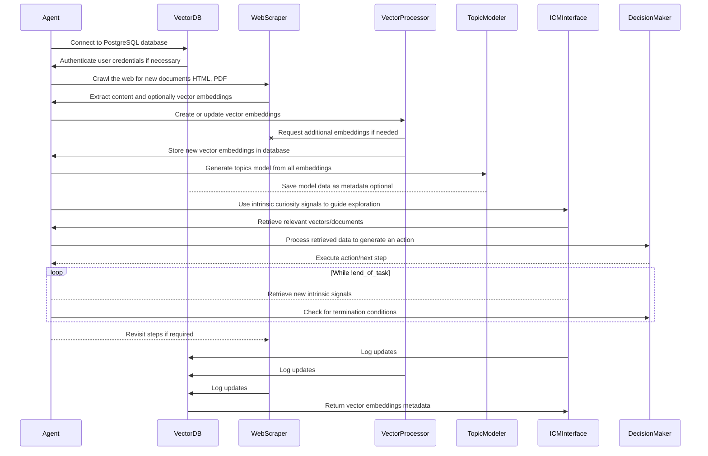

```mermaid
sequenceDiagram
    participant Agent
    participant VectorDB
    participant WebScraper
    participant VectorProcessor
    participant TopicModeler
    participant ICMInterface
    participant DecisionMaker

    Agent ->> VectorDB: Connect to PostgreSQL database
    VectorDB->> Agent: Authenticate user credentials if necessary

    Agent ->> WebScraper: Crawl the web for new documents HTML, PDF
    WebScraper ->> Agent: Extract content and optionally vector embeddings

    Agent ->> VectorProcessor: Create or update vector embeddings
    VectorProcessor -x WebScraper: Request additional embeddings if needed

    VectorProcessor ->> Agent: Store new vector embeddings in database

    Agent ->> TopicModeler: Generate topics model from all embeddings
    TopicModeler --> VectorDB: Save model data as metadata optional

    Agent ->> ICMInterface: Use intrinsic curiosity signals to guide exploration
    ICMInterface ->> Agent: Retrieve relevant vectors/documents

    Agent ->> DecisionMaker: Process retrieved data to generate an action
    DecisionMaker -->> Agent: Execute action/next step

    loop While !end_of_task
        Agent --> ICMInterface: Retrieve new intrinsic signals
        Agent ->> DecisionMaker: Check for termination conditions
    end

    Agent -->> WebScraper: Revisit steps if required

    ICMInterface ->> VectorDB: Log updates
    VectorProcessor ->> VectorDB: Log updates
    WebScraper ->> VectorDB: Log updates

    VectorDB ->> ICMInterface: Return vector embeddings metadata
```
