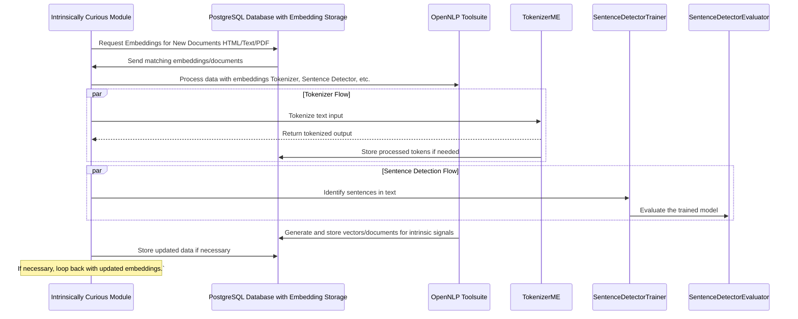

```mermaid
sequenceDiagram
    participant ICM as Intrinsically Curious Module
    participant PostgreSQLDB as PostgreSQL Database with Embedding Storage
    participant OpenNLPToolbox as OpenNLP Toolsuite
    participant TokenizerME
    participant SentenceDetectorTrainer
    participant SentenceDetectorEvaluator

    ICM ->> PostgreSQLDB: Request Embeddings for New Documents HTML/Text/PDF
    PostgreSQLDB ->> ICM: Send matching embeddings/documents

    ICM ->> OpenNLPToolbox: Process data with embeddings Tokenizer, Sentence Detector, etc.

    par Tokenizer Flow
        ICM ->> TokenizerME: Tokenize text input
        TokenizerME -->> ICM: Return tokenized output
        TokenizerME ->> PostgreSQLDB: Store processed tokens if needed
    end

    par Sentence Detection Flow
        ICM ->> SentenceDetectorTrainer: Identify sentences in text
        SentenceDetectorTrainer ->> SentenceDetectorEvaluator: Evaluate the trained model
    end
    
    OpenNLPToolbox ->> PostgreSQLDB: Generate and store vectors/documents for intrinsic signals
    ICM ->> PostgreSQLDB: Store updated data if necessary

    Note over ICM: If necessary, loop back with updated embeddings.`
```
