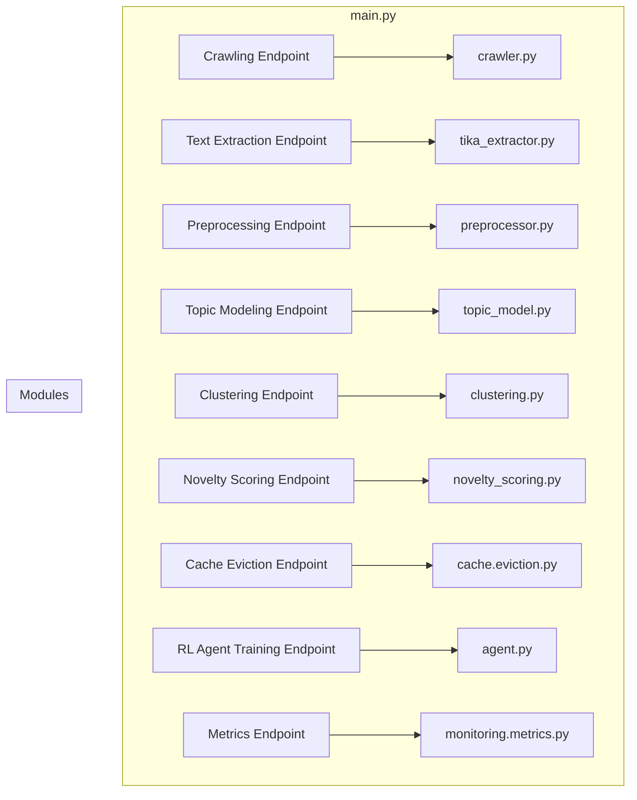

```mermaid
graph TD
    subgraph Flask Application [main.py]
        A[Crawling Endpoint] --> B[crawler.py]
        C[Text Extraction Endpoint] --> D[tika_extractor.py]
        E[Preprocessing Endpoint] --> F[preprocessor.py]
        G[Topic Modeling Endpoint] --> H[topic_model.py]
        I[Clustering Endpoint] --> J[clustering.py]
        K[Novelty Scoring Endpoint] --> L[novelty_scoring.py]
        M[Cache Eviction Endpoint] --> N[cache.eviction.py]
        O[RL Agent Training Endpoint] --> P[agent.py]
        Q[Metrics Endpoint] --> R[monitoring.metrics.py]
    end

    subgraph Modules
        B[crawler.py]
        D[tika_extractor.py]
        F[preprocessor.py]
        H[topic_model.py]
        J[clustering.py]
        L[novelty_scoring.py]
        N[cache.eviction.py]
        P[agent.py]
        R[monitoring.metrics.py]
    end
```
