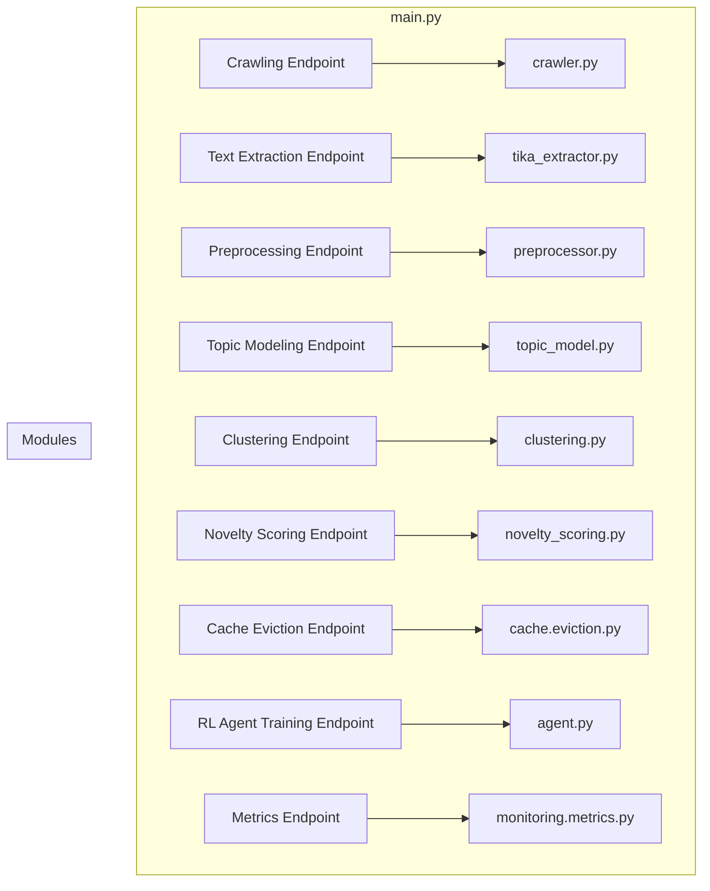

Key Points:

Flask Application (main.py): The central hub, defining endpoints that trigger different functionalities.
Endpoints: Each endpoint is labeled with its purpose and connects to the corresponding module.
Modules: These represent the separate Python files within your app/ directory, each responsible for a specific task (crawling, text extraction, etc.).
Arrows: Indicate the flow of control from the endpoints to the modules they invoke.
Additional Considerations:

Error Handling: Implement error handling within each endpoint to gracefully handle failures or invalid requests.
Authentication/Authorization: If needed, add authentication and authorization to restrict access to certain endpoints.
Logging: Log requests and responses to track the application's activity and diagnose potential issues.
Caching: Consider using caching (e.g., with Flask-Caching) to improve performance for frequently accessed endpoints.
API Documentation: Generate API documentation (e.g., using Swagger/OpenAPI) to make it easier for others to understand and use your application.
