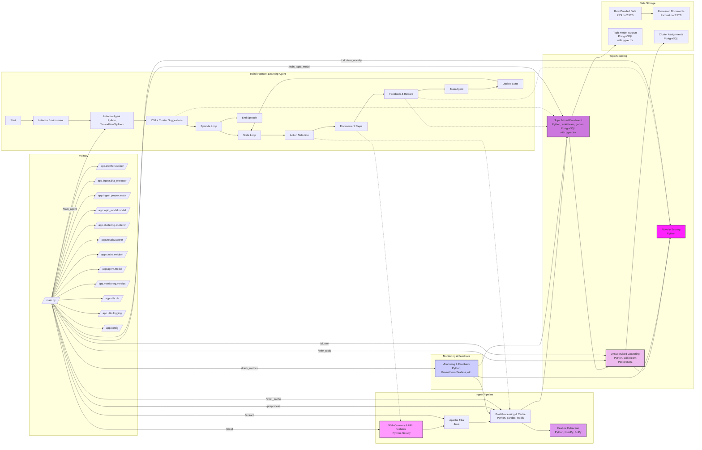

```mermaid
graph LR

subgraph Ingest Pipeline
    A[Web Crawlers & URL Features <br/> Python, Scrapy] --> B[Apache Tika <br/> Java] --> C[Post-Processing & Cache <br/> Python, pandas, Redis]
    C --> E[Feature Extraction <br/> Python, NumPy, SciPy]
end

subgraph Topic Modeling
    C --> D[Topic Model Enrollment <br/> Python, scikit-learn, gensim <br/> PostgreSQL <br/> with pgvector]
    D --> F[Unsupervised Clustering <br/> Python, scikit-learn <br/> PostgreSQL]
    F --> G[Novelty Scoring <br/> Python]
end

subgraph Reinforcement Learning Agent
    AA[Start] --> BB[Initialize Environment]
    BB --> CC[Initialize Agent <br/> Python, TensorFlow/PyTorch]
    CC --> DD[ICM + Cluster Suggestions]
    DD --> EE[Episode Loop]
    EE --> FF[State Loop]
    FF --> GG[Action Selection]
    GG --> HH[Environment Steps]
    HH --> II[Feedback & Reward]
    II --> JJ[Train Agent]
    JJ --> KK[Update State]
    KK --> FF
    EE --> MM[End Episode]
end

subgraph Data Storage
    I[Raw Crawled Data <br/> ZFS on 2.5TB] --> J[Processed Documents <br/> Parquet on 2.5TB]
    D --> K[Topic Model Outputs <br/> PostgreSQL <br/> with pgvector]
    F --> L[Cluster Assignments <br/> PostgreSQL]
end

subgraph Monitoring & Feedback
    H[Monitoring & Feedback <br/> Python, Prometheus/Grafana, etc.] --> C
    H --> D
    H --> G
end

%% Interaction between subsystems
GG -.-> C
HH -.-> A
II -.-> D & G
DD -.-> D

%% main.py components interfacing
subgraph main.py
    M1[/main.py/]
    M2[/app.crawlers.spider/]
    M3[/app.ingest.tika_extractor/]
    M4[/app.ingest.preprocessor/]
    M5[/app.topic_model.model/]
    M6[/app.clustering.clusterer/]
    M7[/app.novelty.scorer/]
    M8[/app.cache.eviction/]
    M9[/app.agent.model/]
    M10[/app.monitoring.metrics/]
    M11[/app.utils.db/]
    M12[/app.utils.logging/]
    M13[/app.config/]
    
    M1 --> M2
    M1 --> M3
    M1 --> M4
    M1 --> M5
    M1 --> M6
    M1 --> M7
    M1 --> M8
    M1 --> M9
    M1 --> M10
    M1 --> M11
    M1 --> M12
    M1 --> M13
end

%% main.py API calls
M1 --> |/crawl| A
M1 --> |/extract| B
M1 --> |/preprocess| C
M1 --> |/train_topic_model| D
M1 --> |/infer_topic| F
M1 --> |/cluster| F
M1 --> |/calculate_novelty| G
M1 --> |/evict_cache| C
M1 --> |/train_agent| CC
M1 --> |/track_metrics| H

style A fill:#f9f,stroke:#333,stroke-width:2px
style H fill:#ccf,stroke:#333,stroke-width:2px
style D fill:#c7d,stroke:#333,stroke-width:2px
style E fill:#d9e,stroke:#333,stroke-width:2px
style F fill:#ebe,stroke:#333,stroke-width:2px
style G fill:#f2f,stroke:#333,stroke-width:2px
```
