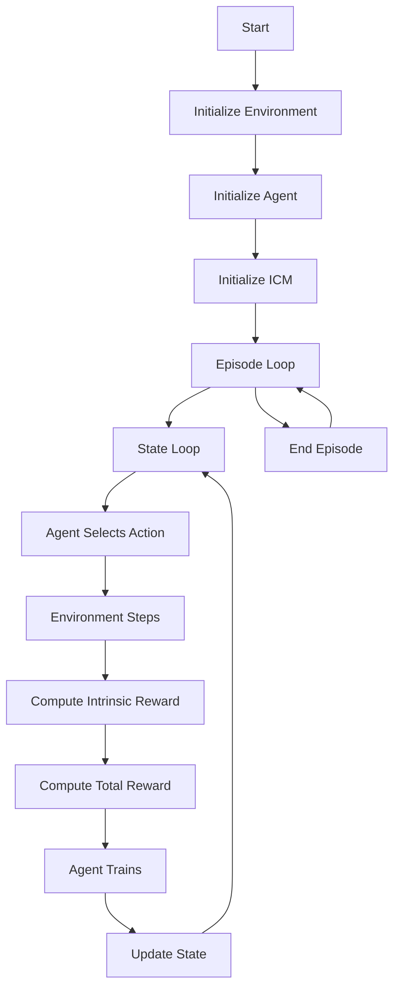

```mermaid
graph TD
    A[Start] --> B[Initialize Environment]
    B --> C[Initialize Agent]
    C --> D[Initialize ICM]
    D --> E[Episode Loop]
    E --> F[State Loop]
    F --> G[Agent Selects Action]
    G --> H[Environment Steps]
    H --> I[Compute Intrinsic Reward]
    I --> J[Compute Total Reward]
    J --> K[Agent Trains]
    K --> L[Update State]
    L --> F
    E --> M[End Episode]
    M --> E
```
