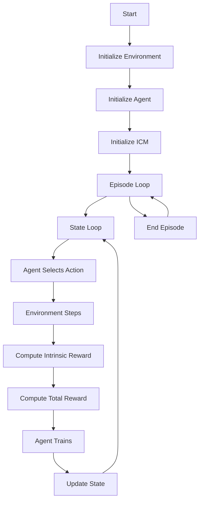

Explanation
Environment: A simplified environment class that generates random states and rewards.

Agent: An agent class that builds a neural network model, selects actions, and trains the model.

ICM: An intrinsic curiosity module that includes a forward model and an inverse model to compute intrinsic rewards.

Training Loop: The main loop that runs episodes, selects actions, computes rewards, and trains the agent.

This refactored version integrates curiosity-driven exploration into the reinforcement learning framework, following the flowchart provided in the Mermaid diagram.

