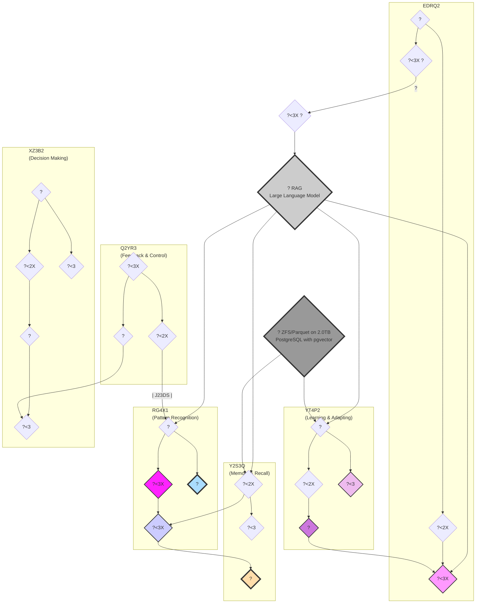

```mermaid
graph TB
%% Central Node: The "Brain" of the Network
U{"?<X ?<3 ?<2X ?<X2 <br/> RAG <br/> Large Language Model"}

%% Connections from the Central Node
U ----> A{"?<3X"}
U ----> H{"?<2X"}
U ----> B{"?<X2"}
U ----> F{"?<X"}


%% The Subgraphs: Clusters of Information
subgraph EDRQ2
  X{"?<X2"} --> Y{"?<2X"}
  X --> Z{"?<3X ?<X2 & ?<2X ?<3"} 
  Y --> A
end

subgraph YT4P2["YT4P2 \n(Learning & Adapting)"]
  B --> C{"?<2X"}
  B --> D{"?<3"}
  C --> E{"?<X"}
  E --> A
end

subgraph RG4X1["RG4X1 \n(Pattern Recognition)"]
  F --> G{"?<3X"}
  F --> J{"?<X"}
  G --> I
end

subgraph Y2S3Q["Y2S3Q \n(Memory & Recall)"]
  H --> I{"?<3X"}
  I --> K{"?<X2"}
  H --> L{"?<3"}
end

subgraph XZ3B2["XZ3B2 \n(Decision Making)"]
  M{"?<X2"} --> N{"?<2X"}
  M --> O{"?<3"}
  N --> P{"?<X"}
  P --> T{"?<3"}
end

subgraph Q2YR3["Q2YR3 \n(Feedback & Control)"]
  Q{"?<3X"} --> R{"?<X2"}
  Q --> S{"?<2X"}
  R --> T
end


%% The Input and Output Layers
Z --> |"?<X2 ?<2X ?<3 ?<X ?<2X"| W{"?<3X ?<X2 & ?<2X ?<3"}
W --> U


%% The Hidden Layer: Unveiling the Mystery
V{"?<X2 <br/> ZFS/Parquet on 2.0TB <br/> PostgreSQL with pgvector"} --> H
V --> B


%% Additional Connections
S --| J23DS |--> F


%% Styling for Visual Depth
style A fill:#f9f,stroke:#333,stroke-width:2px
style I fill:#ccf,stroke:#333,stroke-width:2px
style D fill:#ebe,stroke:#333,stroke-width:2px
style E fill:#c7d,stroke:#333,stroke-width:2px
style G fill:#f2f,stroke:#333,stroke-width:2px
style J fill:#adf,stroke:#333,stroke-width:4px
style K fill:#fda,stroke:#333,stroke-width:4px
style U fill:#ccc, stroke:#333, stroke-width:4px, color:#fff  %% brain-like appearance
style V fill:#999, stroke:#333, stroke-width:4px, color:#fff  %% darker for hidden layer
```
