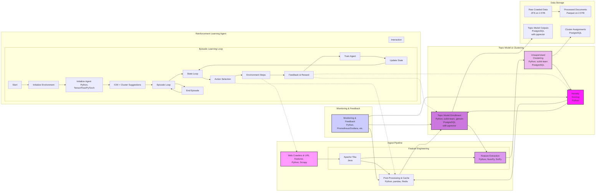

```mermaid
graph LR

subgraph Ingest Pipeline
    A[Web Crawlers & URL Features <br/> Python, Scrapy] --> B[Apache Tika <br/> Java] --> C[Post-Processing & Cache <br/> Python, pandas, Redis]
    
    subgraph Feature Engineering
        B --> E[Feature Extraction <br/> Python, NumPy, SciPy]
    end
end

subgraph Topic Model & Clustering
    C --> D[Topic Model Enrollment <br/> Python, scikit-learn, gensim <br/> PostgreSQL <br/> with pgvector]
    D --> E
    E --> F[Unsupervised <br/> Clustering <br/> Python, scikit-learn <br/> PostgreSQL]
    F --> G[Novelty <br/> Scoring <br/> Python]
    G --> C 
    G --> D
end

subgraph Reinforcement Learning Agent
    subgraph Episodic Learning Loop
        AA[Start] --> BB[Initialize Environment]
        BB --> CC[Initialize Agent <br/> Python, TensorFlow/PyTorch]
        CC --> DD[ICM + Cluster Suggestions]
        DD --> EE[Episode Loop]
        EE --> FF[State Loop]
        FF --> GG[Action Selection]
        GG --> HH[Environment Steps]
        HH --> II[Feedback & Reward]
        II --> JJ[Train Agent]
        JJ --> KK[Update State]
        KK --> FF
        EE --> MM[End Episode]
        MM --> EE
    end

    subgraph Interaction
        GG -.-> C
        HH -.-> A
        II -.-> D & G
    end
end

subgraph Data Storage
    I[Raw Crawled Data <br/> ZFS on 2.5TB] --> J[Processed Documents <br/> Parquet on 2.5TB]
    D --> K[Topic Model Outputs <br/> PostgreSQL <br/> with pgvector]
    F --> L[Cluster Assignments <br/> PostgreSQL]
end

subgraph Monitoring & Feedback
    H[Monitoring & <br/> Feedback <br/> Python, Prometheus/Grafana, etc.] --> C
    H --> D
    H --> G
end

style A fill:#f9f,stroke:#333,stroke-width:2px
style H fill:#ccf,stroke:#333,stroke-width:2px
style D fill:#c7d,stroke:#333,stroke-width:2px
style E fill:#d9e,stroke:#333,stroke-width:2px
style F fill:#ebe,stroke:#333,stroke-width:2px
style G fill:#f2f,stroke:#333,stroke-width:2px
```
