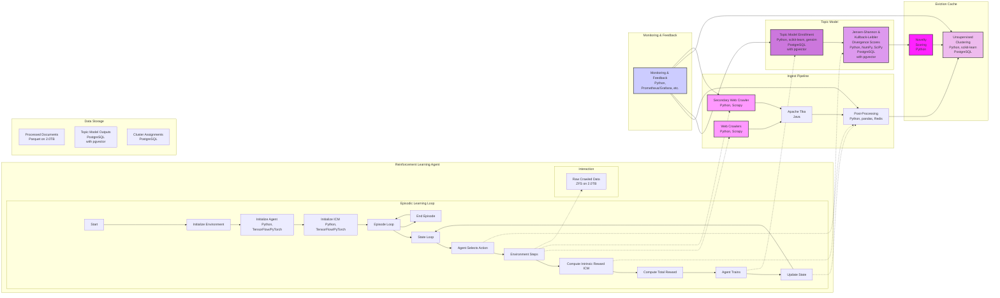

Key Changes:

Secondary Web Crawler (A2): A new node representing the secondary web crawler is added to the Ingest Pipeline subgraph. It uses the same technology (Python, Scrapy) as the primary crawler.
Interaction: The dotted lines show that the Reinforcement Learning Agent's "Environment Steps" (HH) now influence both the primary web crawler (A) and the secondary web crawler (A2).
Monitoring & Feedback: The Monitoring & Feedback component now also monitors the secondary web crawler (A2), ensuring that its behavior is tracked and can be adjusted as needed.
Explanation:

Primary Crawler (A): Continues to perform the main crawling tasks, exploring the web based on initial seeds or user queries.
ICM (DD): During the reinforcement learning process, the ICM identifies potentially interesting URLs or domains based on novelty and relevance.
Secondary Crawler (A2): The ICM's suggestions trigger the secondary crawler. This crawler focuses on exploring the suggested URLs/domains more deeply, discovering additional related links and content.
Feedback Loop: The data gathered by the secondary crawler is fed back into the primary ingestion pipeline. This new data is then processed by Apache Tika, used to update the topic model, and clustered for further analysis by the ICM. This creates a continuous loop where the ICM guides the secondary crawler, and the secondary crawler provides new data that further refines the ICM's understanding of novelty and interest.
Additional Considerations:

Resource Management: The secondary crawler might need separate resource constraints (e.g., crawl depth, crawl rate) to avoid overwhelming the system.
Prioritization: You'll need a strategy to prioritize the URLs suggested by the ICM. This could involve factors like novelty scores, topic relevance, or external signals (e.g., user feedback).
This refactored diagram illustrates a more refined approach to curiosity-driven web crawling, allowing your system to actively explore and adapt to the changing landscape of information on the web.
