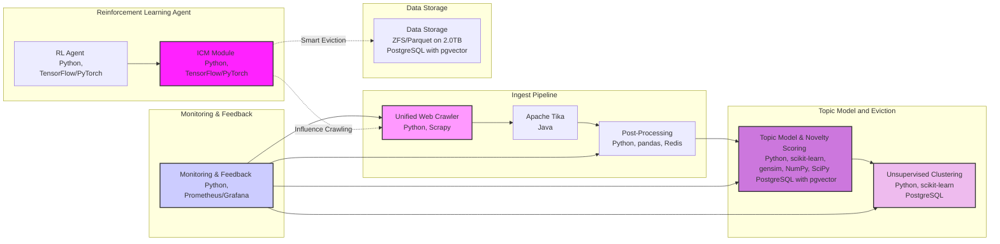

```mermaid
graph LR
    subgraph Ingest Pipeline
        A[Unified Web Crawler <br/> Python, Scrapy] --> B[Apache Tika <br/> Java] --> C[Post-Processing <br/> Python, pandas, Redis]
    end

    subgraph Topic Model and Eviction
        C --> D[Topic Model & Novelty Scoring <br/> Python, scikit-learn, gensim, NumPy, SciPy <br/> PostgreSQL with pgvector] --> E[Unsupervised Clustering <br/> Python, scikit-learn <br/> PostgreSQL]
    end

    subgraph Reinforcement Learning Agent
        F[RL Agent <br/> Python, TensorFlow/PyTorch] --> G[ICM Module <br/> Python, TensorFlow/PyTorch]
    end

    subgraph Data Storage
        H[Data Storage <br/> ZFS/Parquet on 2.0TB <br/> PostgreSQL with pgvector]
    end

    subgraph Monitoring & Feedback
        I[Monitoring & Feedback <br/> Python, Prometheus/Grafana] --> C
        I --> D
        I --> E
        I --> A
    end

    G -. Influence Crawling .-> A
    G -. Smart Eviction .-> H

    style A fill:#f9f,stroke:#333,stroke-width:2px
    style I fill:#ccf,stroke:#333,stroke-width:2px
    style D fill:#c7d,stroke:#333,stroke-width:2px
    style E fill:#ebe,stroke:#333,stroke-width:2px
    style G fill:#f2f,stroke:#333,stroke-width:2px
```
