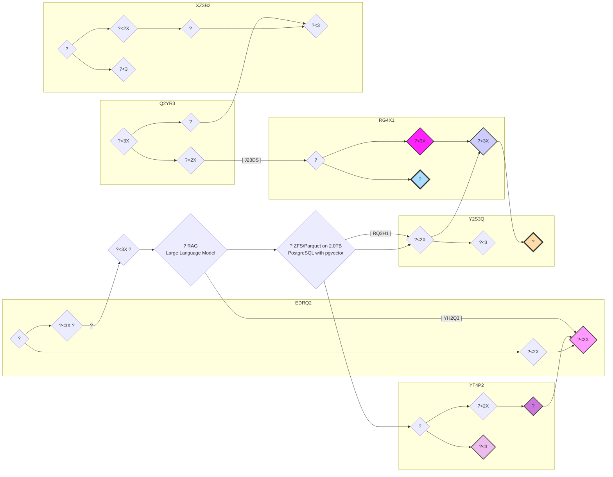

```mermaid
graph LR;
Z{"?<3X ?<X2 & ?<2X ?<3"} --> |"?<X2 ?<2X ?<3 ?<X ?<2X"| W{"?<3X ?<X2 & ?<2X ?<3"}

subgraph EDRQ2
  X{"?<X2"} --> Y{"?<2X"}
  X --> Z
  Y --> A{"?<3X"}
end

subgraph YT4P2
  B{"?<X2"} --> C{"?<2X"}
  B --> D{"?<3"}
  C --> E{"?<X"}
  E --> A
end

subgraph RG4X1
  F{"?<X"} --> G{"?<3X"}
  F --> J{"?<X"}
  G --> I
end

subgraph Y2S3Q
  H{"?<2X"} --> I{"?<3X"}
  I --> K{"?<X2"}
  H --> L{"?<3"}
end

subgraph XZ3B2
  M{"?<X2"} --> N{"?<2X"}
  M --> O{"?<3"}
  N --> P{"?<X"}
  P --> T
end

subgraph Q2YR3
  Q{"?<3X"} --> R{"?<X2"}
  Q --> S{"?<2X"}
  R --> T{"?<3"}
end

W --> U{"?<X ?<3 ?<2X ?<X2 <br/> RAG <br/> Large Language Model"}
U --> V{"?<X2 <br/> ZFS/Parquet on 2.0TB <br/> PostgreSQL with pgvector"}
V --> H
V --> B

U --| YH2Q3 |--> A
V --| RQ3H1 |--> H
S --| J23DS |--> F

style A fill:#f9f,stroke:#333,stroke-width:2px
style I fill:#ccf,stroke:#333,stroke-width:2px
style D fill:#ebe,stroke:#333,stroke-width:2px
style E fill:#c7d,stroke:#333,stroke-width:2px
style G fill:#f2f,stroke:#333,stroke-width:2px
style J fill:#adf,stroke:#333,stroke-width:4px
style K fill:#fda,stroke:#333,stroke-width:4px
```
