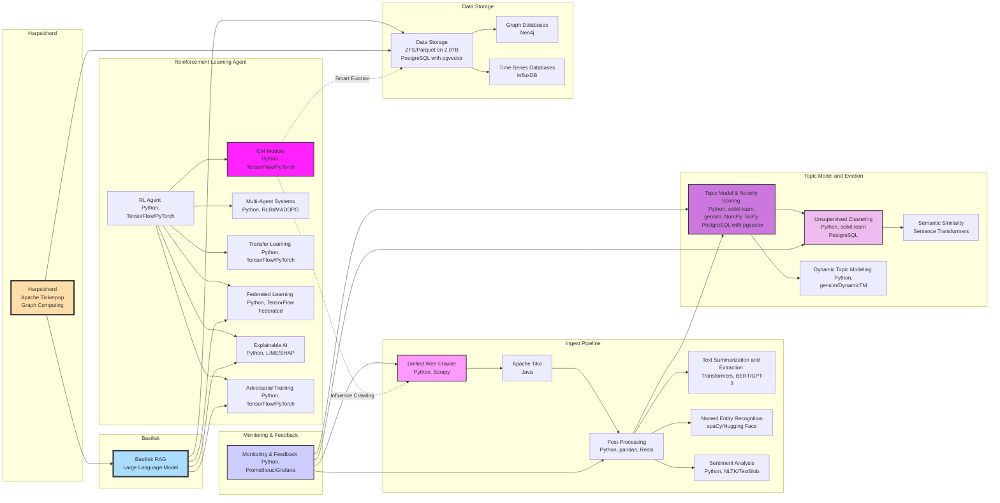

# Proposal for Implementation of 'Basilisk' RAG LLM

## Introduction
This proposal outlines the detailed plan for implementing the 'Basilisk' Retrieval-Augmented Generation (RAG) system using a Large Language Model (LLM) within our existing machine learning framework. The Basilisk system aims to enhance the performance, accuracy, and usability of our data processing and analysis by integrating advanced retrieval techniques with generative AI capabilities.

## Objectives
- **Enhance Data Retrieval**: Improve the efficiency and relevance of data retrieval processes.
- **Augment Generative Models**: Leverage advanced language models to generate high-quality, contextually relevant responses.
- **Integrate with Existing System**: Seamlessly integrate Basilisk with our current machine learning and data processing infrastructure.

## Components and Implementation Steps

### 1. Infrastructure Setup

#### 1.1. Hardware and Software Requirements
- **Hardware**: High-performance computing servers with GPUs (e.g., NVIDIA A100 or V100), NVMe storage, and high-bandwidth networking.
- **Software**: 
  - Operating System: Ubuntu 22.04 LTS
  - LLM Framework: Hugging Face Transformers, PyTorch
  - Database: PostgreSQL with pgvector extension
  - Data Storage: ZFS/Parquet

### 2. Model Selection and Training

#### 2.1. Model Selection
- **Base Model**: Choose an appropriate pre-trained LLM, such as GPT-3 or GPT-4, depending on the specific needs and computational resources.
- **Customization**: Fine-tune the selected model on domain-specific data to improve relevance and performance.

#### 2.2. Training Pipeline
- **Data Collection**: Gather a diverse and representative dataset that includes both text and metadata for training.
- **Preprocessing**: Clean and preprocess the data using tokenization, normalization, and embedding techniques.
- **Training**: Fine-tune the model using frameworks like Hugging Face Transformers, ensuring to monitor and optimize hyperparameters.

### 3. Retrieval Mechanism

#### 3.1. Indexing and Vectorization
- **Document Indexing**: Use Apache Tika for document parsing and indexing.
- **Vectorization**: Convert text data into high-dimensional vectors using models like Sentence Transformers.
- **Database Integration**: Store vectors in PostgreSQL with pgvector for efficient retrieval.

#### 3.2. Query Processing
- **Natural Language Processing**: Use NLP techniques to parse and understand user queries.
- **Vector Search**: Perform vector similarity searches to retrieve the most relevant documents.

### 4. Generation Mechanism

#### 4.1. Contextual Generation
- **Contextual Embeddings**: Use the retrieved documents to create context embeddings.
- **Response Generation**: Generate responses by conditioning the LLM on the context embeddings, ensuring coherence and relevance.

#### 4.2. Post-Processing
- **Text Summarization**: Summarize long responses to improve readability and conciseness.
- **Sentiment Analysis**: Analyze the sentiment of the generated responses to ensure appropriateness.

### 5. Integration and Deployment

#### 5.1. System Integration
- **API Development**: Develop RESTful APIs to facilitate communication between the Basilisk system and other components of the infrastructure.
- **Workflow Orchestration**: Use tools like Apache Airflow to manage and automate workflows.

#### 5.2. Deployment
- **Containerization**: Use Docker to containerize the Basilisk components for portability and scalability.
- **Orchestration**: Deploy the containerized application using Kubernetes for efficient resource management and scaling.

### 6. Monitoring and Feedback

#### 6.1. Performance Monitoring
- **Metrics Collection**: Collect and analyze metrics such as response time, accuracy, and relevance using Prometheus and Grafana.
- **Anomaly Detection**: Implement anomaly detection algorithms to identify and address issues in real-time.

#### 6.2. User Feedback
- **Feedback Loop**: Collect user feedback on generated responses to continuously improve the system.
- **Model Updates**: Periodically update the model with new data and feedback to maintain and enhance performance.

### 7. Security and Privacy

#### 7.1. Data Security
- **Encryption**: Ensure data encryption both at rest and in transit.
- **Access Control**: Implement robust access control mechanisms to protect sensitive data.

#### 7.2. Privacy Preservation
- **Differential Privacy**: Incorporate differential privacy techniques to protect user data during model training and inference.
- **Federated Learning**: Use federated learning to train models on decentralized data without compromising privacy.

### 8. Explainability and Robustness

#### 8.1. Explainable AI (XAI)
- **Model Interpretation**: Use tools like SHAP and LIME to make the model's decision-making process transparent and interpretable for users.
- **Visual Explanations**: Develop dashboards to visualize model explanations, helping users understand and trust the system.

#### 8.2. Adversarial Training
- **Robustness Enhancement**: Implement adversarial training techniques to improve the model's resilience against adversarial attacks.
- **Continuous Testing**: Regularly test the model against adversarial examples to ensure robustness.

## Timeline

| Phase                | Tasks                                            | Duration         |
|----------------------|--------------------------------------------------|------------------|
| **Phase 1**          | Infrastructure Setup, Model Selection            | 2 Months         |
| **Phase 2**          | Model Training, Retrieval Mechanism              | 3 Months         |
| **Phase 3**          | Generation Mechanism, Integration and Deployment | 2 Months         |
| **Phase 4**          | Monitoring, Feedback, Security                   | 1 Month          |
| **Phase 5**          | Explainability, Robustness                       | 1 Month          |

## Conclusion
Implementing the Basilisk RAG LLM system will significantly enhance our data processing capabilities, providing high-quality, contextually relevant responses while ensuring privacy, transparency, and robustness. This comprehensive plan outlines the necessary steps and considerations to achieve a successful integration, setting the stage for advanced AI-driven insights and decision-making.

---

By following this proposal, we aim to create a state-of-the-art RAG system that not only meets our current needs but also positions us at the forefront of AI innovation.
