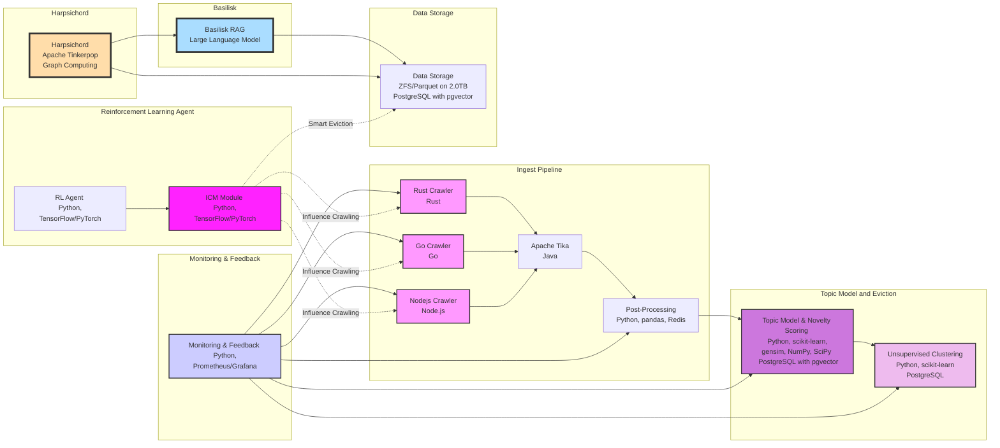

```mermaid
graph LR
    subgraph Ingest Pipeline
        A1[Rust Crawler <br/> Rust] --> B[Apache Tika <br/> Java] --> C[Post-Processing <br/> Python, pandas, Redis]
        A2[Go Crawler <br/> Go] --> B
        A3[Nodejs Crawler <br/> Node.js] --> B
    end

    subgraph Topic Model and Eviction
        C --> D[Topic Model & Novelty Scoring <br/> Python, scikit-learn, gensim, NumPy, SciPy <br/> PostgreSQL with pgvector] --> E[Unsupervised Clustering <br/> Python, scikit-learn <br/> PostgreSQL]
    end

    subgraph Reinforcement Learning Agent
        F[RL Agent <br/> Python, TensorFlow/PyTorch] --> G[ICM Module <br/> Python, TensorFlow/PyTorch]
    end

    subgraph Data Storage
        H[Data Storage <br/> ZFS/Parquet on 2.0TB <br/> PostgreSQL with pgvector]
    end

    subgraph Monitoring & Feedback
        I[Monitoring & Feedback <br/> Python, Prometheus/Grafana] --> C
        I --> D
        I --> E
        I --> A1
        I --> A2
        I --> A3
    end

    subgraph Basilisk
        J[Basilisk RAG <br/> Large Language Model] --> H
    end

    subgraph Harpsichord
        K[Harpsichord <br/> Apache Tinkerpop <br/> Graph Computing] --> J
        K --> H
    end

    G -. Influence Crawling .-> A1
    G -. Influence Crawling .-> A2
    G -. Influence Crawling .-> A3
    G -. Smart Eviction .-> H

    style A1 fill:#f9f,stroke:#333,stroke-width:2px
    style A2 fill:#f9f,stroke:#333,stroke-width:2px
    style A3 fill:#f9f,stroke:#333,stroke-width:2px
    style I fill:#ccf,stroke:#333,stroke-width:2px
    style D fill:#c7d,stroke:#333,stroke-width:2px
    style E fill:#ebe,stroke:#333,stroke-width:2px
    style G fill:#f2f,stroke:#333,stroke-width:2px
    style J fill:#adf,stroke:#333,stroke-width:4px
    style K fill:#fda,stroke:#333,stroke-width:4px
```
