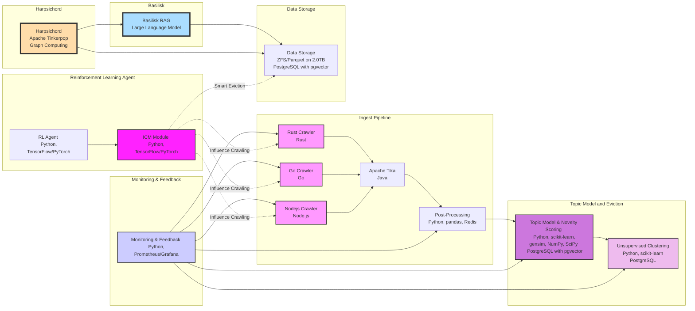
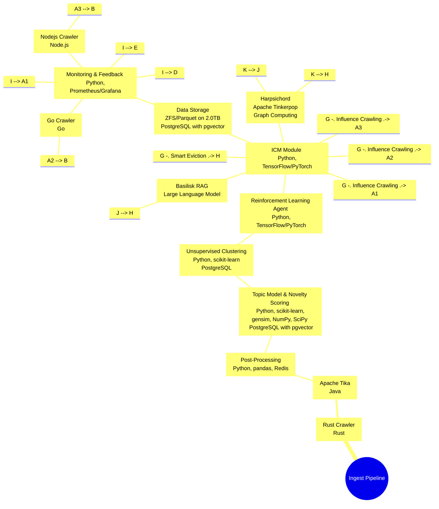

Using Rust, Go, and Node.js for web crawlers in the ingest pipeline offers several advantages:

1. **Performance and Efficiency**: 
   - **Rust**: Known for its memory safety without a garbage collector, Rust allows for efficient memory management and high performance, making it ideal for intensive web crawling tasks where performance and safety are critical.
   - **Go**: Offers lightweight goroutines for concurrent tasks, making it highly efficient for scalable web crawlers that can handle multiple tasks in parallel without heavy use of system resources.

2. **Scalability**:
   - Both Go and Rust are designed with concurrency in mind, allowing for the development of highly scalable web crawlers that can handle a large number of requests simultaneously.
   - Node.js, with its non-blocking I/O model, excels in handling a large number of connections efficiently, making it suitable for IO-bound tasks in web crawling.

3. **Ecosystem and Community**:
   - **Node.js**: Has a vast ecosystem with numerous libraries and tools for web scraping and crawling, such as Cheerio, Puppeteer, and Axios, making it easier to implement complex crawling tasks.
   - **Go and Rust**: Both have growing communities and ecosystems, providing robust libraries and frameworks that can be leveraged for web crawling, such as Colly for Go and Reqwest for Rust.

4. **Ease of Development**:
   - **Node.js**: JavaScript is a widely known language, and using Node.js for crawling allows developers to use the same language on both the frontend and backend, simplifying development.
   - **Go**: Offers simplicity and clarity in syntax, making it easy to write and maintain crawler code.
   - **Rust**: While having a steeper learning curve, it offers powerful features like pattern matching and zero-cost abstractions that can lead to more robust and error-free code.

5. **Robustness and Reliability**:
   - **Rust**: Its compiler and ownership model ensure memory safety and thread safety, reducing the number of runtime errors and making the crawlers more reliable.
   - **Go**: Designed with simplicity and reliability in mind, Go's standard library and tooling provide a solid foundation for building dependable services.

6. **Cross-Platform Compatibility**:
   - All three languages compile to native code and support cross-platform development, allowing the crawlers to run on various operating systems without significant changes to the codebase.

In summary, incorporating Rust, Go, and Node.js into the ingest pipeline leverages the unique strengths of each language, offering a blend of performance, scalability, ease of development, and reliability, making the web crawling process more efficient and effective.
