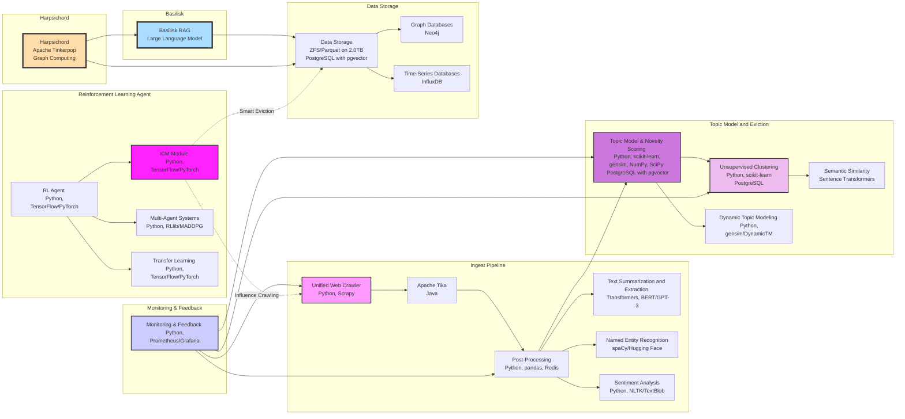
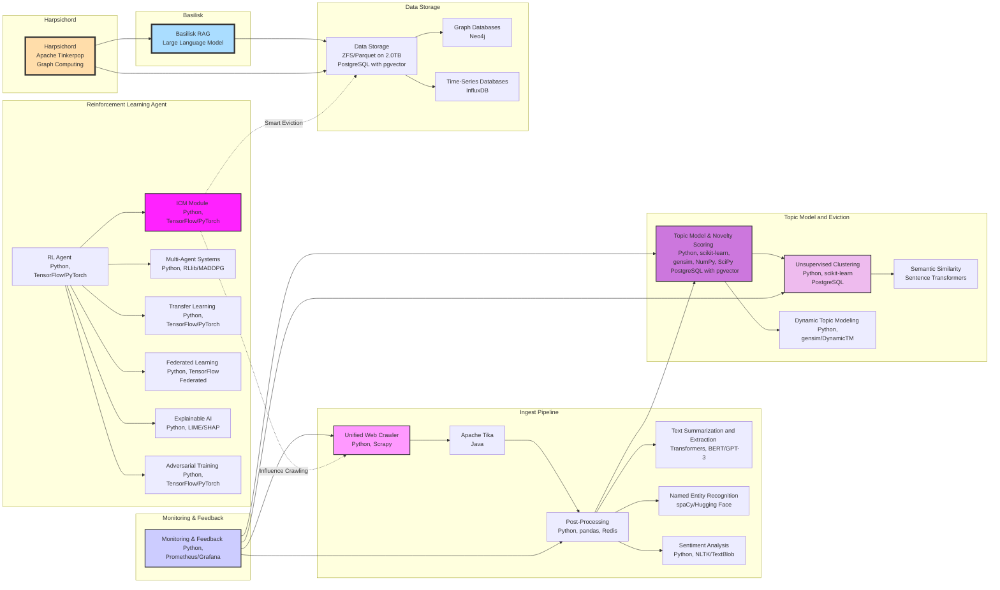

```mermaid
graph LR
    subgraph Ingest Pipeline
        A[Unified Web Crawler <br/> Python, Scrapy] --> B[Apache Tika <br/> Java] --> C[Post-Processing <br/> Python, pandas, Redis]
        C --> TS[Text Summarization and Extraction <br/> Transformers, BERT/GPT-3]
        C --> NER[Named Entity Recognition <br/> spaCy/Hugging Face]
        C --> SA[Sentiment Analysis <br/> Python, NLTK/TextBlob]
    end

    subgraph Topic Model and Eviction
        C --> D[Topic Model & Novelty Scoring <br/> Python, scikit-learn, gensim, NumPy, SciPy <br/> PostgreSQL with pgvector] --> E[Unsupervised Clustering <br/> Python, scikit-learn <br/> PostgreSQL]
        D --> DTM[Dynamic Topic Modeling <br/> Python, gensim/DynamicTM]
        E --> SS[Semantic Similarity <br/> Sentence Transformers]
    end

    subgraph Reinforcement Learning Agent
        F[RL Agent <br/> Python, TensorFlow/PyTorch] --> G[ICM Module <br/> Python, TensorFlow/PyTorch]
        F --> MARL[Multi-Agent Systems <br/> Python, RLlib/MADDPG]
        F --> TL[Transfer Learning <br/> Python, TensorFlow/PyTorch]
    end

    subgraph Data Storage
        H[Data Storage <br/> ZFS/Parquet on 2.0TB <br/> PostgreSQL with pgvector]
        H --> GD[Graph Databases <br/> Neo4j]
        H --> TSD[Time-Series Databases <br/> InfluxDB]
    end

    subgraph Monitoring & Feedback
        I[Monitoring & Feedback <br/> Python, Prometheus/Grafana] --> C
        I --> D
        I --> E
        I --> A
    end

    subgraph Basilisk
        J[Basilisk RAG <br/> Large Language Model] --> H
    end

    subgraph Harpsichord
        K[Harpsichord <br/> Apache Tinkerpop <br/> Graph Computing] --> J
        K --> H
    end

    G -. Influence Crawling .-> A
    G -. Smart Eviction .-> H

    style A fill:#f9f,stroke:#333,stroke-width:2px
    style I fill:#ccf,stroke:#333,stroke-width:2px
    style D fill:#c7d,stroke:#333,stroke-width:2px
    style E fill:#ebe,stroke:#333,stroke-width:2px
    style G fill:#f2f,stroke:#333,stroke-width:2px
    style J fill:#adf,stroke:#333,stroke-width:4px
    style K fill:#fda,stroke:#333,stroke-width:4px
```

```mermaid
graph LR
    subgraph Ingest Pipeline
        A[Unified Web Crawler <br/> Python, Scrapy] --> B[Apache Tika <br/> Java] --> C[Post-Processing <br/> Python, pandas, Redis]
        C --> TS[Text Summarization and Extraction <br/> Transformers, BERT/GPT-3]
        C --> NER[Named Entity Recognition <br/> spaCy/Hugging Face]
        C --> SA[Sentiment Analysis <br/> Python, NLTK/TextBlob]
    end

    subgraph Topic Model and Eviction
        C --> D[Topic Model & Novelty Scoring <br/> Python, scikit-learn, gensim, NumPy, SciPy <br/> PostgreSQL with pgvector] --> E[Unsupervised Clustering <br/> Python, scikit-learn <br/> PostgreSQL]
        D --> DTM[Dynamic Topic Modeling <br/> Python, gensim/DynamicTM]
        E --> SS[Semantic Similarity <br/> Sentence Transformers]
    end

    subgraph Reinforcement Learning Agent
        F[RL Agent <br/> Python, TensorFlow/PyTorch] --> G[ICM Module <br/> Python, TensorFlow/PyTorch]
        F --> MARL[Multi-Agent Systems <br/> Python, RLlib/MADDPG]
        F --> TL[Transfer Learning <br/> Python, TensorFlow/PyTorch]
        F --> FL[Federated Learning <br/> Python, TensorFlow Federated]
        F --> XAI[Explainable AI <br/> Python, LIME/SHAP]
        F --> AT[Adversarial Training <br/> Python, TensorFlow/PyTorch]
    end

    subgraph Data Storage
        H[Data Storage <br/> ZFS/Parquet on 2.0TB <br/> PostgreSQL with pgvector]
        H --> GD[Graph Databases <br/> Neo4j]
        H --> TSD[Time-Series Databases <br/> InfluxDB]
    end

    subgraph Monitoring & Feedback
        I[Monitoring & Feedback <br/> Python, Prometheus/Grafana] --> C
        I --> D
        I --> E
        I --> A
    end

    subgraph Basilisk
        J[Basilisk RAG <br/> Large Language Model] --> H
    end

    subgraph Harpsichord
        K[Harpsichord <br/> Apache Tinkerpop <br/> Graph Computing] --> J
        K --> H
    end

    G -. Influence Crawling .-> A
    G -. Smart Eviction .-> H

    style A fill:#f9f,stroke:#333,stroke-width:2px
    style I fill:#ccf,stroke:#333,stroke-width:2px
    style D fill:#c7d,stroke:#333,stroke-width:2px
    style E fill:#ebe,stroke:#333,stroke-width:2px
    style G fill:#f2f,stroke:#333,stroke-width:2px
    style J fill:#adf,stroke:#333,stroke-width:4px
    style K fill:#fda,stroke:#333,stroke-width:4px
```
