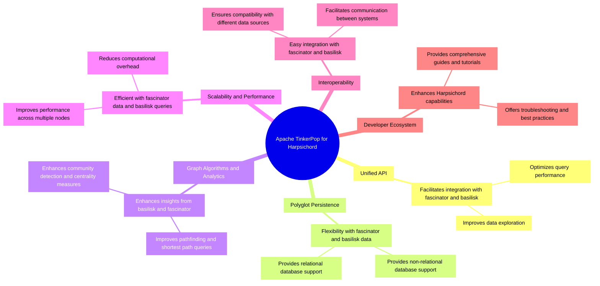

```mermaid
mindmap
  root((Apache TinkerPop for Harpsichord))
    A[Unified API]
      A -->|Gremlin for graph manipulation| A1[Facilitates integration with fascinator and basilisk]
        A1 -->|Handles complex queries| A1a[Optimizes query performance]
        A1 -->|Supports traversal framework| A1b[Improves data exploration]
    B[Polyglot Persistence]
      B -->|Work with multiple databases| B1[Flexibility with fascinator and basilisk data]
        B1 -->|Supports NoSQL databases| B1a[Provides non-relational database support]
        B1 -->|Supports SQL databases| B1b[Provides relational database support]
    C[Graph Algorithms and Analytics]
      C -->|Library of tools for analysis| C1[Enhances insights from basilisk and fascinator]
        C1 -->|Graph traversal algorithms| C1a[Improves pathfinding and shortest path queries]
        C1 -->|Graph analytics algorithms| C1b[Enhances community detection and centrality measures]
    D[Scalability and Performance]
      D -->|Designed for large-scale data| D1[Efficient with fascinator data and basilisk queries]
        D1 -->|Supports distributed processing| D1a[Improves performance across multiple nodes]
        D1 -->|Optimizes resource usage| D1b[Reduces computational overhead]
    E[Interoperability]
      E -->|Supports various databases and systems| E1[Easy integration with fascinator and basilisk]
        E1 -->|Standardized data formats| E1a[Ensures compatibility with different data sources]
        E1 -->|APIs for seamless integration| E1b[Facilitates communication between systems]
    F[Developer Ecosystem]
      F -->|Vibrant community and documentation| F1[Enhances Harpsichord capabilities]
        F1 -->|Extensive documentation| F1a[Provides comprehensive guides and tutorials]
        F1 -->|Active community support| F1b[Offers troubleshooting and best practices]
```
