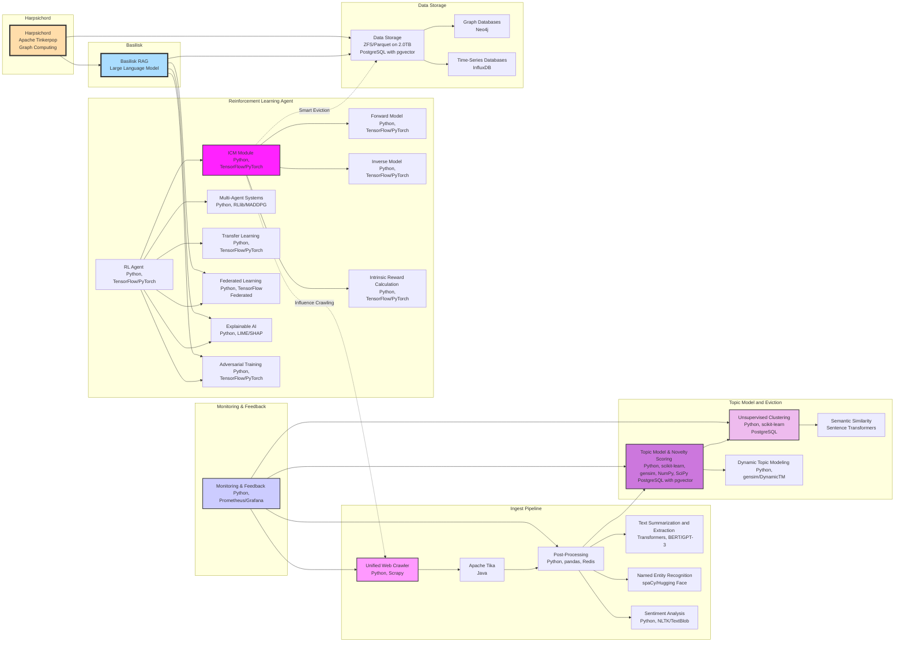

# Proposal for Implementation of 'ICM' Intrinsic Curiosity Module for the Ensemble

## Introduction
This proposal outlines the detailed plan for implementing the Intrinsic Curiosity Module (ICM) within our existing machine learning framework. The ICM aims to enhance the exploration capabilities of our Reinforcement Learning (RL) agents by providing intrinsic motivation, allowing the agents to discover and learn from novel states and actions more effectively.

## Objectives
- **Enhance Exploration**: Improve the ability of RL agents to explore the state space by providing intrinsic rewards.
- **Facilitate Learning**: Enable agents to learn more efficiently from their environment by encouraging exploration of less visited states.
- **Integrate with Existing System**: Seamlessly integrate the ICM with our current reinforcement learning and data processing infrastructure.

## Components and Implementation Steps

### 1. Infrastructure Setup

#### 1.1. Hardware and Software Requirements
- **Hardware**: High-performance computing servers with GPUs (e.g., NVIDIA A100 or V100), optimized for deep learning tasks.
- **Software**:
  - Operating System: Ubuntu 22.04 LTS
  - RL Framework: PyTorch or TensorFlow
  - Integration Tools: Docker, Kubernetes

### 2. ICM Model Design

#### 2.1. Architecture
- **Forward Model**: Predicts the next state given the current state and action.
- **Inverse Model**: Predicts the action taken given the current and next state.

#### 2.2. Network Design
- **Neural Networks**: Design and implement neural networks for the forward and inverse models using PyTorch or TensorFlow.
- **Feature Extractors**: Use convolutional neural networks (CNNs) for feature extraction from state representations.

### 3. Training Pipeline

#### 3.1. Data Collection
- **Environment Interaction**: Collect data by allowing the RL agent to interact with the environment, recording state transitions and actions.

#### 3.2. Preprocessing
- **Normalization**: Normalize the state and action data to ensure consistent input to the neural networks.
- **Batch Processing**: Implement batch processing for efficient training.

#### 3.3. Training
- **Loss Functions**: Define loss functions for the forward model (mean squared error) and the inverse model (cross-entropy loss).
- **Optimization**: Use stochastic gradient descent (SGD) or Adam optimizer for training the networks.

### 4. Integration with RL Agent

#### 4.1. Intrinsic Reward Calculation
- **Error Computation**: Compute the prediction error of the forward model as the intrinsic reward.
- **Reward Shaping**: Integrate the intrinsic reward with the extrinsic reward from the environment to shape the overall reward signal.

#### 4.2. Agent Modification
- **Policy Update**: Modify the RL agent's policy update mechanism to incorporate the combined reward signal.
- **Exploration Strategy**: Adjust the exploration strategy (e.g., epsilon-greedy, softmax) to leverage intrinsic rewards.

### 5. System Integration and Deployment

#### 5.1. System Integration
- **API Development**: Develop RESTful APIs to facilitate communication between the ICM and other components of the infrastructure.
- **Workflow Orchestration**: Use tools like Apache Airflow to manage and automate workflows.

#### 5.2. Deployment
- **Containerization**: Use Docker to containerize the ICM components for portability and scalability.
- **Orchestration**: Deploy the containerized application using Kubernetes for efficient resource management and scaling.

### 6. Monitoring and Feedback

#### 6.1. Performance Monitoring
- **Metrics Collection**: Collect and analyze metrics such as exploration efficiency, learning rate, and overall performance using Prometheus and Grafana.
- **Anomaly Detection**: Implement anomaly detection algorithms to identify and address issues in real-time.

#### 6.2. User Feedback
- **Feedback Loop**: Collect user feedback on the agent's performance and exploration behavior to continuously improve the system.
- **Model Updates**: Periodically update the ICM and RL agent based on feedback and new data.

### 7. Security and Privacy

#### 7.1. Data Security
- **Encryption**: Ensure data encryption both at rest and in transit.
- **Access Control**: Implement robust access control mechanisms to protect sensitive data.

#### 7.2. Privacy Preservation
- **Data Anonymization**: Use data anonymization techniques to protect user privacy.
- **Access Logging**: Maintain logs of data access and modifications for audit purposes.

### 8. Explainability and Robustness

#### 8.1. Explainable AI (XAI)
- **Model Interpretation**: Use tools like SHAP and LIME to make the ICM's decision-making process transparent and interpretable for users.
- **Visualization Tools**: Develop dashboards to visualize the intrinsic rewards and the agent's exploration patterns.

#### 8.2. Robustness Enhancement
- **Adversarial Training**: Implement adversarial training techniques to improve the robustness of the ICM and RL agent against adversarial attacks.
- **Regular Testing**: Conduct regular tests to ensure the robustness and reliability of the ICM module.

## Timeline

| Phase                | Tasks                                            | Duration         |
|----------------------|--------------------------------------------------|------------------|
| **Phase 1**          | Infrastructure Setup, Model Design               | 2 Months         |
| **Phase 2**          | Training Pipeline, Data Collection               | 2 Months         |
| **Phase 3**          | Integration with RL Agent, Intrinsic Reward Calculation | 2 Months         |
| **Phase 4**          | System Integration, Deployment                   | 1 Month          |
| **Phase 5**          | Monitoring, Feedback, Security                   | 1 Month          |
| **Phase 6**          | Explainability, Robustness                       | 1 Month          |

## Conclusion
Implementing the Intrinsic Curiosity Module (ICM) will significantly enhance our RL agents' exploration capabilities, leading to more efficient learning and better performance. By providing intrinsic motivation, the ICM encourages agents to discover and learn from novel states, improving their overall effectiveness in complex environments.

---

By following this proposal, we aim to create a state-of-the-art ICM that not only meets our current needs but also positions us at the forefront of AI-driven exploration and learning.



# ICM Model Design

## 2.1. Architecture

### Forward Model
The forward model in the ICM architecture is designed to predict the next state based on the current state and action. This model helps in understanding the dynamics of the environment by estimating the state transitions.

- **Inputs**:
  - **Current State (S_t)**: The representation of the current state.
  - **Action (A_t)**: The action taken at the current state.
- **Output**:
  - **Next State (S_{t+1})**: The predicted next state.

The forward model is trained to minimize the prediction error, which is the difference between the actual next state and the predicted next state. This error serves as an intrinsic reward to encourage exploration in reinforcement learning.

### Inverse Model
The inverse model predicts the action taken given the current and next state. This model helps the agent to infer the action needed to transition from one state to another, thereby understanding the relationship between states and actions.

- **Inputs**:
  - **Current State (S_t)**: The representation of the current state.
  - **Next State (S_{t+1})**: The representation of the next state.
- **Output**:
  - **Action (A_t)**: The predicted action that caused the transition from the current state to the next state.

The inverse model is trained to minimize the classification error between the predicted action and the actual action taken.

## 2.2. Network Design

### Neural Networks
The neural networks for the forward and inverse models are implemented using PyTorch or TensorFlow. These frameworks provide robust libraries and tools for building and training deep learning models.

#### Forward Model Network
- **Input Layer**: Concatenation of the current state and action.
- **Hidden Layers**: Multiple fully connected (dense) layers with activation functions (e.g., ReLU).
- **Output Layer**: A layer producing the predicted next state.

#### Inverse Model Network
- **Input Layer**: Concatenation of the current state and next state.
- **Hidden Layers**: Multiple fully connected (dense) layers with activation functions (e.g., ReLU).
- **Output Layer**: A layer producing the predicted action (e.g., softmax activation for discrete actions).

### Feature Extractors
Feature extraction is a critical step in processing the raw state representations before feeding them into the neural networks. Convolutional Neural Networks (CNNs) are employed for this purpose due to their ability to capture spatial hierarchies in data, making them ideal for extracting features from image-based state representations.

#### CNN Architecture for Feature Extraction
- **Input Layer**: Raw state representation (e.g., images).
- **Convolutional Layers**: Multiple layers of convolutions with varying filter sizes to capture different features.
- **Pooling Layers**: Max pooling or average pooling layers to reduce the spatial dimensions and computational load.
- **Fully Connected Layers**: Dense layers to further process the features extracted by the convolutional layers.
- **Output Layer**: Feature vector representing the processed state.

The extracted features are then used as inputs to the forward and inverse models, providing a richer representation of the states, which enhances the prediction accuracy.

### Implementation Example

#### Forward Model Network (PyTorch)
```python
import torch
import torch.nn as nn
import torch.optim as optim

class ForwardModel(nn.Module):
    def __init__(self, state_dim, action_dim, hidden_dim):
        super(ForwardModel, self).__init__()
        self.fc1 = nn.Linear(state_dim + action_dim, hidden_dim)
        self.fc2 = nn.Linear(hidden_dim, hidden_dim)
        self.fc3 = nn.Linear(hidden_dim, state_dim)

    def forward(self, state, action):
        x = torch.cat([state, action], dim=1)
        x = torch.relu(self.fc1(x))
        x = torch.relu(self.fc2(x))
        next_state = self.fc3(x)
        return next_state

state_dim = 100  # Example state dimension
action_dim = 10  # Example action dimension
hidden_dim = 128

forward_model = ForwardModel(state_dim, action_dim, hidden_dim)
optimizer = optim.Adam(forward_model.parameters(), lr=0.001)
loss_fn = nn.MSELoss()
```

#### Inverse Model Network (PyTorch)
```python
class InverseModel(nn.Module):
    def __init__(self, state_dim, action_dim, hidden_dim):
        super(InverseModel, self).__init__()
        self.fc1 = nn.Linear(state_dim * 2, hidden_dim)
        self.fc2 = nn.Linear(hidden_dim, hidden_dim)
        self.fc3 = nn.Linear(hidden_dim, action_dim)

    def forward(self, state, next_state):
        x = torch.cat([state, next_state], dim=1)
        x = torch.relu(self.fc1(x))
        x = torch.relu(self.fc2(x))
        action_pred = torch.softmax(self.fc3(x), dim=1)
        return action_pred

inverse_model = InverseModel(state_dim, action_dim, hidden_dim)
optimizer = optim.Adam(inverse_model.parameters(), lr=0.001)
loss_fn = nn.CrossEntropyLoss()
```

### Feature Extractor using CNN (PyTorch)
```python
class FeatureExtractor(nn.Module):
    def __init__(self, input_channels, feature_dim):
        super(FeatureExtractor, self).__init__()
        self.conv1 = nn.Conv2d(input_channels, 32, kernel_size=3, stride=1, padding=1)
        self.conv2 = nn.Conv2d(32, 64, kernel_size=3, stride=1, padding=1)
        self.pool = nn.MaxPool2d(kernel_size=2, stride=2, padding=0)
        self.fc1 = nn.Linear(64 * 8 * 8, feature_dim)  # Example dimensions

    def forward(self, x):
        x = self.pool(torch.relu(self.conv1(x)))
        x = self.pool(torch.relu(self.conv2(x)))
        x = x.view(-1, 64 * 8 * 8)  # Flattening
        feature_vector = torch.relu(self.fc1(x))
        return feature_vector

input_channels = 3  # Example for RGB images
feature_dim = 100   # Example feature dimension

feature_extractor = FeatureExtractor(input_channels, feature_dim)
```

## Conclusion
The forward and inverse models in the ICM architecture are essential components for providing intrinsic rewards and facilitating efficient learning. By employing CNNs for feature extraction and leveraging deep neural networks, the ICM can effectively predict state transitions and actions, driving the exploration and learning capabilities of our RL agents. The detailed architecture and network designs provided above form the foundation for implementing a robust and scalable ICM module within our existing machine learning framework.
