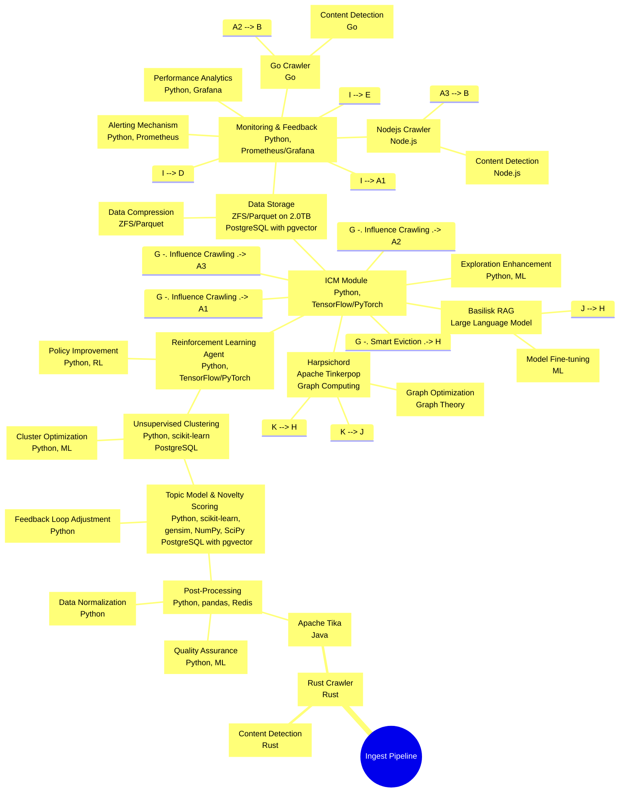

```mermaid
mindmap
  root((Ingest Pipeline))
    A1[Rust Crawler <br/> Rust]
      A1 --> B1[Content Detection <br/> Rust]
      A1 --> B[Apache Tika <br/> Java]
        B --> C[Post-Processing <br/> Python, pandas, Redis]
          C --> C1[Data Normalization <br/> Python]
          C --> C2[Quality Assurance <br/> Python, ML]
          C --> D[Topic Model & Novelty Scoring <br/> Python, scikit-learn, gensim, NumPy, SciPy <br/> PostgreSQL with pgvector]
            D --> D1[Feedback Loop Adjustment <br/> Python]
            D --> E[Unsupervised Clustering <br/> Python, scikit-learn <br/> PostgreSQL]
              E --> E1[Cluster Optimization <br/> Python, ML]
              E --> F[Reinforcement Learning Agent <br/> Python, TensorFlow/PyTorch]
                F --> F1[Policy Improvement <br/> Python, RL]
                F --> G[ICM Module <br/> Python, TensorFlow/PyTorch]
                  G --> G1[Exploration Enhancement <br/> Python, ML]
                  G --> H[Data Storage <br/> ZFS/Parquet on 2.0TB <br/> PostgreSQL with pgvector]
                    H --> H1[Data Compression <br/> ZFS/Parquet]
                    H --> I[Monitoring & Feedback <br/> Python, Prometheus/Grafana]
                      I --> I1[Alerting Mechanism <br/> Python, Prometheus]
                      I --> I2[Performance Analytics <br/> Python, Grafana]
                      I --> A1
                      I --> A2[Go Crawler <br/> Go]
                        A2 --> B2[Content Detection <br/> Go]
                        A2 --> B
                      I --> A3[Nodejs Crawler <br/> Node.js]
                        A3 --> B3[Content Detection <br/> Node.js]
                        A3 --> B
                      I --> D
                      I --> E
                  G --> J[Basilisk RAG <br/> Large Language Model]
                    J --> J1[Model Fine-tuning <br/> ML]
                    J --> H
                  G --> K[Harpsichord <br/> Apache Tinkerpop <br/> Graph Computing]
                    K --> K1[Graph Optimization <br/> Graph Theory]
                    K --> J
                    K --> H
                  G -. Influence Crawling .-> A1
                  G -. Influence Crawling .-> A2
                  G -. Influence Crawling .-> A3
                  G -. Smart Eviction .-> H
```
