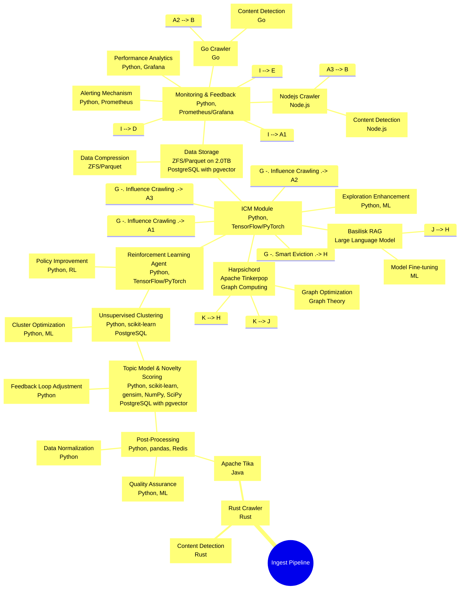
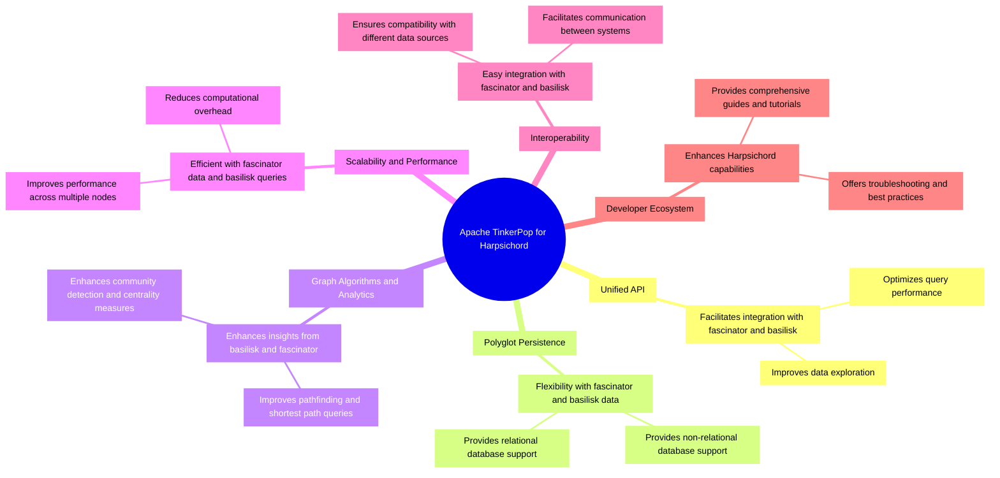

The system ensemble described in the Mermaid diagram is a sophisticated data processing pipeline designed for web data ingestion, topic modeling, clustering, reinforcement learning, data storage, and monitoring. Here's an explanation of each component and its role within the system:

### Ingest Pipeline
- **Unified Web Crawler (A):** This component, implemented using Python and Scrapy, is responsible for crawling the web and collecting raw data from various sources.
- **Apache Tika (B):** Written in Java, Apache Tika processes the raw data collected by the web crawler, extracting text and metadata from various file formats (e.g., HTML, PDF, DOC).
- **Post-Processing (C):** After data extraction, this component (using Python, pandas, and Redis) cleans, organizes, and prepares the data for further analysis.

### Topic Model and Eviction
- **Topic Model & Novelty Scoring (D):** Using Python, scikit-learn, gensim, NumPy, and SciPy, this component performs topic modeling to identify themes within the data. It also scores the data for novelty to determine its relevance. The results are stored in a PostgreSQL database with pgvector extension for efficient vector operations.
- **Unsupervised Clustering (E):** This component uses Python and scikit-learn to cluster the data based on the topics identified, storing the results back in the PostgreSQL database.

### Reinforcement Learning Agent
- **RL Agent (F):** Implemented in Python using TensorFlow or PyTorch, this agent applies reinforcement learning techniques to optimize the system’s performance.
- **ICM Module (G):** The Intrinsic Curiosity Module (ICM) works alongside the RL agent to enhance learning by rewarding novel and informative actions. It influences the web crawling strategy (influencing which data to crawl next) and manages smart eviction (deciding which data to retain or discard).

### Data Storage
- **Data Storage (H):** This component uses ZFS/Parquet for efficient data storage, supporting up to 2.0TB. It also uses PostgreSQL with the pgvector extension for managing and querying large-scale vector data.

### Monitoring & Feedback
- **Monitoring & Feedback (I):** Implemented using Python, Prometheus, and Grafana, this component monitors the system’s performance, providing feedback to various parts of the pipeline. It ensures the system runs smoothly and adapts to changes in the data or processing requirements.

### Interconnections
- **Influence Crawling (G to A):** The RL agent's ICM module influences the web crawling process, optimizing the selection of data sources to crawl based on novelty and relevance.
- **Smart Eviction (G to H):** The RL agent also decides which data to retain or discard from storage, ensuring efficient use of storage resources.

### Styles
- **Component Styles:**
  - **Unified Web Crawler (A)** is highlighted in pink.
  - **Monitoring & Feedback (I)** is highlighted in light blue.
  - **Topic Model & Novelty Scoring (D)** is highlighted in light purple.
  - **Unsupervised Clustering (E)** is highlighted in light violet.
  - **ICM Module (G)** is highlighted in light magenta.

This ensemble represents a comprehensive and adaptive data processing system capable of handling large-scale web data, extracting meaningful insights, and continuously improving its performance through reinforcement learning and feedback mechanisms.

Apache TinkerPop is a graph computing framework that provides an efficient way to process and analyze large-scale graph data. In the context of the "Harpsichord" module, which leverages both "basilisk" and "fascinator" resources, Apache TinkerPop offers several key features and benefits:

1. **Unified API**: TinkerPop provides a unified API, Gremlin, for graph manipulation and traversal. This allows "Harpsichord" to interact with various graph databases and systems using a consistent language, facilitating the integration of data from "fascinator" and insights generated by "basilisk".

2. **Polyglot Persistence**: TinkerPop supports polyglot persistence, enabling "Harpsichord" to work with multiple graph databases and storage systems without being tied to a specific technology. This flexibility is crucial for leveraging the diverse data stored by "fascinator" and processed by "basilisk".

3. **Graph Algorithms and Analytics**: TinkerPop includes a library of graph algorithms and analytics tools. "Harpsichord" can use these tools to perform complex analyses on the interconnected data, such as finding patterns, detecting anomalies, or understanding relationships, enhancing the insights derived from "basilisk" and "fascinator".

4. **Scalability and Performance**: TinkerPop is designed for scalability, allowing "Harpsichord" to handle large volumes of data and complex graph computations efficiently. This is essential for processing the extensive data collected and analyzed by "fascinator" and the complex queries generated by "basilisk".

5. **Interoperability**: With its wide support for various graph databases and systems, TinkerPop enables "Harpsichord" to easily integrate and interoperate with other components of the system, such as "fascinator's" data storage and "basilisk's" language model outputs.

6. **Developer Ecosystem**: TinkerPop has a vibrant developer ecosystem and comprehensive documentation, providing "Harpsichord" developers with resources, libraries, and tools to enhance the module's capabilities and ensure its successful integration with "fascinator" and "basilisk".

In summary, Apache TinkerPop's features and benefits significantly enhance the "Harpsichord" module's ability to leverage graph data for advanced computing and analytics, making it a powerful component of the system that integrates seamlessly with "fascinator" and "basilisk".

Several popular alternatives to Apache TinkerPop offer graph computing capabilities, each with its unique features and strengths. Here are some notable ones:

1. **Neo4j**: 
   - **Features**: Neo4j is a highly popular graph database that provides its own Cypher query language for graph traversal and manipulation. It offers a rich set of tools for graph analytics, visualization, and a robust ecosystem of plugins and integrations.
   - **Benefits**: Its performance optimizations for graph queries, user-friendly query language, and comprehensive tooling make it an excellent choice for applications requiring deep graph analytics and complex relationship handling.

2. **ArangoDB**:
   - **Features**: ArangoDB is a multi-model database that supports graph, document, and key/value data models. It uses AQL (ArangoDB Query Language) for querying and has built-in support for graph algorithms.
   - **Benefits**: The flexibility of supporting multiple data models and the ability to perform complex graph operations and transactions make it suitable for versatile applications.

3. **Amazon Neptune**:
   - **Features**: Amazon Neptune is a fully managed graph database service optimized for storing billions of relationships and querying the graph with milliseconds latency. It supports both TinkerPop Gremlin and RDF/SPARQL.
   - **Benefits**: Its cloud-native, fully managed nature reduces operational overhead, and its support for both property graph and RDF models provides flexibility in graph modeling.

4. **OrientDB**:
   - **Features**: OrientDB is a multi-model database that supports graph, document, object, and key/value models. It offers SQL-like query language with extensions for graph operations.
   - **Benefits**: Its multi-model approach allows for flexible data modeling and querying, making it suitable for applications that require the combination of graph and other data models.

5. **JanusGraph**:
   - **Features**: JanusGraph is an open-source, distributed graph database designed to support the processing of large graphs. It is built on top of Apache TinkerPop and supports various storage backends like Apache Cassandra, Apache HBase, and Google Cloud Bigtable.
   - **Benefits**: Its scalability and support for various storage backends make it ideal for large-scale graph applications. Being built on TinkerPop, it also benefits from the Gremlin query language and ecosystem.

6. **TigerGraph**:
   - **Features**: TigerGraph is a scalable graph database designed for deep link analytics. It offers a graph query language called GSQL, which is SQL-like and designed for expressive and efficient graph queries.
   - **Benefits**: Its high performance, scalability, and deep link analytics capabilities make it well-suited for applications requiring real-time graph analytics on large datasets.

Each of these alternatives has its strengths and is suited to different types of graph computing needs, from highly scalable cloud-native solutions to versatile multi-model databases.

Neo4j is a highly popular graph database known for its performance, ease of use, and rich feature set tailored for graph data management and analysis. As an alternative to Apache TinkerPop for graph computing, Neo4j offers several key features and benefits:

1. **Cypher Query Language**:
   - **Features**: Cypher is a declarative graph query language that allows for expressive and efficient querying and manipulation of graph data. It is designed specifically for graph databases, making it intuitive for defining patterns and relationships.
   - **Benefits**: The ease of use and expressiveness of Cypher make it accessible for developers and analysts, reducing the learning curve and increasing productivity in graph operations.

2. **High-Performance Graph Engine**:
   - **Features**: Neo4j's native graph storage and processing engine is optimized for storing and querying connected data. It is designed to handle highly connected data efficiently.
   - **Benefits**: This results in excellent performance for graph queries, especially for deep traversal and complex relationship queries, making it suitable for real-time applications.

3. **ACID Transactions**:
   - **Features**: Neo4j supports ACID (Atomicity, Consistency, Isolation, Durability) transactions, ensuring data integrity and consistency even in complex transaction scenarios.
   - **Benefits**: This feature is crucial for applications that require reliable data operations, such as financial services, ensuring that all transactions are processed reliably and without data loss or corruption.

4. **Scalability and High Availability**:
   - **Features**: Neo4j offers clustering capabilities for scalability and high availability. Its architecture supports read and write scalability, along with failover and recovery mechanisms.
   - **Benefits**: This ensures that applications can scale as needed while maintaining high availability, making Neo4j suitable for enterprise-level applications with demanding requirements.

5. **Rich Ecosystem and Integrations**:
   - **Features**: Neo4j boasts a vibrant ecosystem with a wide range of tools, libraries, and integrations for data import/export, visualization, and analytics.
   - **Benefits**: This ecosystem facilitates the development of comprehensive graph-based solutions and allows for easy integration with other tools and systems, enhancing developer productivity and operational efficiency.

6. **Graph Algorithms and Analytics**:
   - **Features**: Neo4j includes a library of graph algorithms that can be applied directly within the database for analytics and data science tasks.
   - **Benefits**: This allows for the execution of complex analytics and machine learning workflows directly on the graph data, enabling insights into patterns, communities, and relationships within the data.

7. **Visual Exploration and Management Tools**:
   - **Features**: Neo4j provides powerful tools for visual graph exploration and database management, such as Neo4j Browser and Neo4j Bloom.
   - **Benefits**: These tools make it easier to develop, debug, and visualize graph data and queries, enhancing the understandability of graph data and facilitating communication of insights.

In summary, Neo4j's combination of a powerful graph-specific query language, high-performance graph engine, robust transaction support, scalability, and a rich ecosystem makes it a compelling choice for applications that require efficient and intuitive graph computing capabilities.

