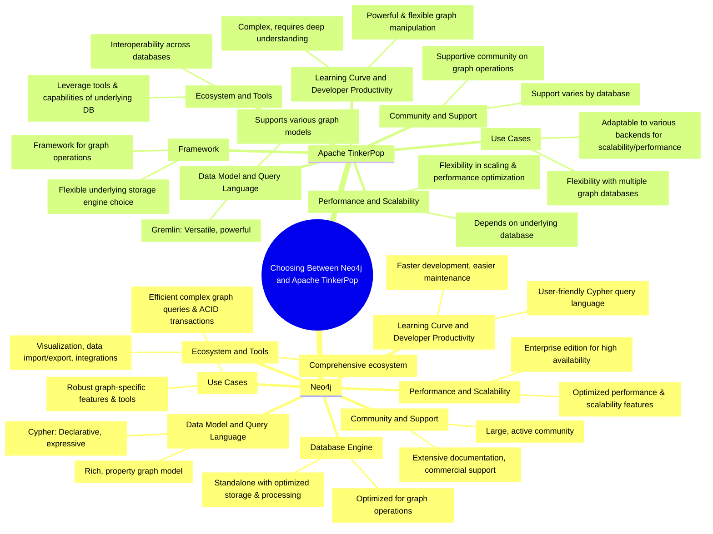

Neo4j supports a wide range of graph algorithms that can be applied directly within the database, leveraging its graph processing capabilities. These algorithms are crucial for uncovering insights from connected data, enabling applications in various domains such as social network analysis, recommendation systems, fraud detection, and more. Here are some popular graph algorithms available in Neo4j:

1. **Pathfinding and Search Algorithms**:
   - **Shortest Path**: Finds the shortest path between two nodes.
   - **All Shortest Paths**: Identifies all shortest paths between two nodes.
   - **Dijkstra's Algorithm**: Computes the shortest path between nodes based on weighted edges.
   - **A* (A Star)**: Optimizes pathfinding with heuristics, useful for weighted graphs.

2. **Centrality Algorithms**:
   - **PageRank**: Measures the importance of each node within the graph, based on the number and quality of links to each node.
   - **Betweenness Centrality**: Identifies nodes that serve as bridges between different parts of the graph.
   - **Closeness Centrality**: Measures how close a node is to all other nodes in the graph.
   - **Degree Centrality**: Counts the number of direct connections a node has.

3. **Community Detection Algorithms**:
   - **Louvain Method**: Identifies communities in large networks based on modularity optimization.
   - **Label Propagation**: Uses network structures to propagate labels and form communities.
   - **Weakly Connected Components**: Finds sets of connected nodes in a directed graph where each node is reachable from any other node in the same set.
   - **Strongly Connected Components**: Identifies groups of nodes in a directed graph where every node is reachable from every other node in the same group.

4. **Similarity Algorithms**:
   - **Jaccard Similarity**: Measures the similarity between sets, useful for recommendation systems.
   - **Cosine Similarity**: Computes similarity as the cosine of the angle between two vectors, ideal for text analysis.
   - **Pearson Similarity**: Measures the linear correlation between two sets of data.

5. **Link Prediction Algorithms**:
   - **Adamic-Adar**: Predicts links in a social network based on shared neighbors.
   - **Resource Allocation Index**: Identifies potential links by considering shared neighbors' connections.
   - **Preferential Attachment**: Assumes that nodes with higher degrees are more likely to create new connections.

6. **Graph Embedding Algorithms**:
   - **Node2Vec**: Generates vector representations of nodes, capturing the network's topology for machine learning applications.
   - **DeepWalk**: Similar to Node2Vec, uses random walks to learn representations for nodes in a graph.

These algorithms enable Neo4j to perform complex analyses and extract meaningful patterns from graph data, making it a powerful tool for applications requiring deep insights into connected data.

When choosing between Neo4j and Apache TinkerPop for graph computing, several considerations come into play, each depending on the specific requirements of your project, including scalability, performance, ecosystem, and specific features. Here's a breakdown of key considerations:

1. **Graph Model and Query Language**:
   - **Neo4j** uses its own graph model and the Cypher query language, which is highly expressive and optimized for graph operations.
   - **Apache TinkerPop** provides a more flexible model through the Gremlin query language, which can be more complex but allows for a wide range of graph manipulations and is database-agnostic.

2. **Database Engine and Storage**:
   - **Neo4j** is a standalone graph database engine with its own storage system, optimized for storing and querying graph data.
   - **Apache TinkerPop** is a framework that can be implemented on top of various graph databases, offering flexibility in choosing an underlying storage engine that best fits the project's needs.

3. **Ecosystem and Integrations**:
   - **Neo4j** has a rich ecosystem with a wide range of tools, libraries, and integrations for data import/export, visualization, and analytics.
   - **Apache TinkerPop** benefits from being able to integrate with multiple graph databases and tools, potentially offering a broader range of options depending on the underlying database chosen.

4. **Performance and Scalability**:
   - **Neo4j** offers robust performance optimizations for graph queries and transactions, with enterprise features for scalability and high availability.
   - **Apache TinkerPop**'s performance and scalability depend on the underlying database used. It allows for the flexibility to choose a backend that scales according to the project's requirements.

5. **Community and Support**:
   - **Neo4j** has a large and active community, with extensive documentation and commercial support options available.
   - **Apache TinkerPop** also has a supportive community, especially among developers working with various graph databases, and benefits from the support provided by the communities of the specific databases it is used with.

6. **Learning Curve and Developer Productivity**:
   - **Neo4j**'s Cypher query language is often praised for its readability and ease of use, which can lead to quicker development cycles.
   - **Apache TinkerPop**'s Gremlin offers powerful and flexible graph operations but has a steeper learning curve due to its verbose syntax and complex concepts.

7. **Use Case and Application Requirements**:
   - **Neo4j** is well-suited for applications requiring deep graph analytics, complex queries, and ACID transactions, such as recommendation systems, fraud detection, and network and IT operations.
   - **Apache TinkerPop** is ideal for projects that require flexibility in terms of the underlying database technology or those that might benefit from the ability to switch databases with minimal changes to the application code.

In summary, the choice between Neo4j and Apache TinkerPop depends on specific project requirements, including the preferred graph model and query language, performance and scalability needs, ecosystem and community support, and the learning curve for developers.
