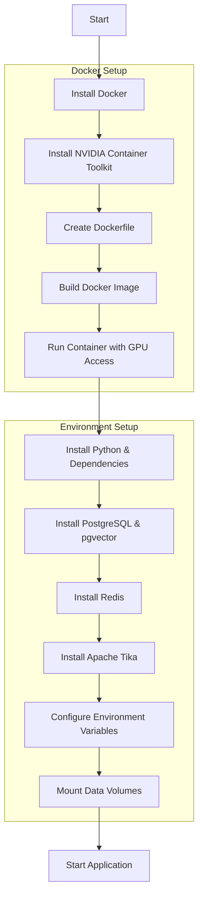

Flowchart Breakdown:

Start: The starting point of your setup process.
Install Docker: Install Docker on your Ubuntu 22.04 host system.
Install NVIDIA Container Toolkit: This enables GPU access within your Docker containers.
Create Dockerfile: Define the steps to build your custom Docker image, including base image selection, software installation, and configuration.
Build Docker Image: Use the docker build command to create your image based on the Dockerfile.
Run Container with GPU Access: Use docker run with the --gpus all flag to start a container and enable GPU access.
Install Python & Dependencies: Install Python, pip, and the required Python libraries (NumPy, SciPy, scikit-learn, pandas, TensorFlow/PyTorch, etc.) within the container.
Install PostgreSQL & pgvector: Install PostgreSQL, create databases and users, and enable the pgvector extension.
Install Redis: Install and configure the Redis server within the container.
Install Apache Tika: Download and install Apache Tika for content extraction.
Configure Environment Variables: Set environment variables for database connections, Redis host/port, and other configuration options.
Mount Data Volumes: Use Docker volumes to persist data outside the container (for raw crawled data, processed documents, PostgreSQL data).
Start Application: Run your Python scripts to start the web crawlers, topic modeling, clustering, novelty scoring, and monitoring processes.
Additional Notes:

Dockerfile:
Base image: nvidia/cuda:11.8.0-cudnn8-runtime-ubuntu22.04 (or a similar NVIDIA GPU-enabled image)
Install python3, python3-pip, postgresql-client, redis-server, openjdk-17-jre-headless, etc.
Use pip3 to install Python libraries.
Add commands to download and install Apache Tika.
Include instructions for PostgreSQL setup (create databases, users, enable pgvector).
Set up environment variables and mount volumes as needed.
Error Handling: Incorporate error handling at each step (e.g., check for successful installation, connection testing for PostgreSQL and Redis).
Automation: Consider using scripts or automation tools (like Ansible or Make) to streamline the setup process.

