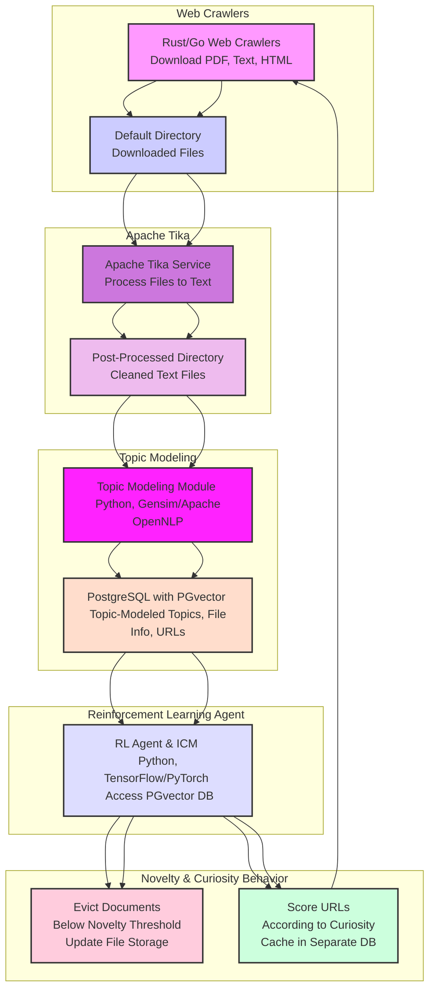

Web crawlers written primarily in Rust, Go lang will crawl websites/domains and download pdf, text, html, etc. files to a default directory. Apache Tika will run as a service and look for any files in said file download directory. Upon finding files it will process them into text, strip headers and other unnecessary formatting, etc. Apache tika post-processed files are placed in another directory which is monitored by our topic modeling module (likely using python, Gensim, but could also utilize Apache OpenNLP). The topic-modeled topics are enrolled in our PostGres PGvector database along with the file name of the original downloaded file/document and the URL it was downloaded from. Our reinforcement learning agent/ICM (intrinsic curiosity module) will access the pgvector db in order to generate novelty or curiosity behavior. The novelty/curiosity behavior will perform two tasks: 1.) act to evict documents from the file storage that fall below a certain threshold of "novelty." 2.) score crawled URLs according to "curiosity" which will then be cached in a separate database and fed back into our web crawlers for additional analysis/further crawling for connected URLs, and  so on. Please generate a mermaid diagram which clarifies this concept of operation for the 'fascinator' ensemble.

Here is a detailed Mermaid diagram that clarifies the concept of operation for the "fascinator" ensemble:

### Explanation:

1. **Web Crawlers:**
   - **Rust/Go Web Crawlers** download various file types (PDF, text, HTML) and save them to a default directory.

2. **Apache Tika:**
   - The **Apache Tika Service** monitors the default directory, processes the files to text, strips headers, and removes unnecessary formatting.
   - Processed text files are placed in the **Post-Processed Directory**.

3. **Topic Modeling:**
   - The **Topic Modeling Module** (using Python, Gensim, or Apache OpenNLP) monitors the post-processed directory, analyzes the text files, and extracts topics.
   - Extracted topics, along with the file name and the URL, are stored in the **PostgreSQL with PGvector** database.

4. **Reinforcement Learning Agent:**
   - The **RL Agent & ICM** accesses the PGvector database to generate novelty or curiosity behavior.

5. **Novelty & Curiosity Behavior:**
   - **Eviction:** Documents falling below a novelty threshold are evicted from file storage.
   - **Scoring:** URLs are scored according to curiosity and cached in a separate database.
   - These scores are fed back into the web crawlers to guide further crawling.

By following this diagram, you can visualize the flow of data and the interactions between different components in your "fascinator" ensemble. This ensures a clear understanding of how each part of the system contributes to the overall operation.
