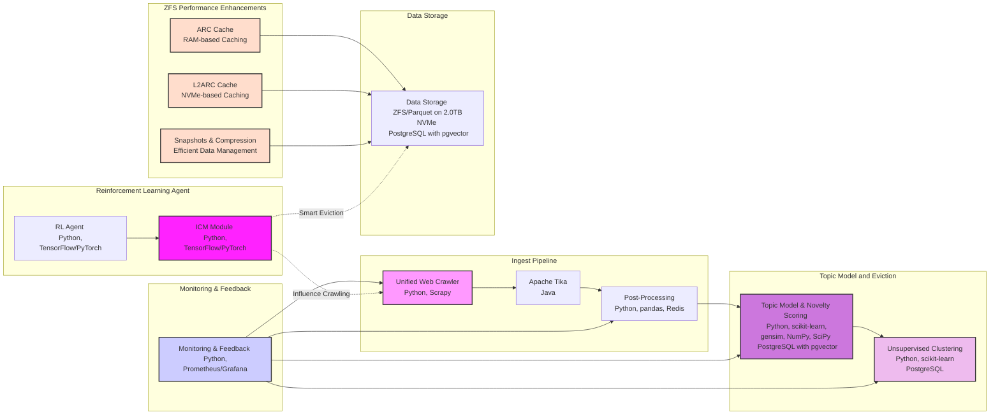

To refactor the original Mermaid diagram to reflect how the ZFS file system on the NVMe host drive enhances the performance of the components, we can highlight the key areas where ZFS caching (ARC and L2ARC) and other features provide performance benefits. This involves adding annotations and nodes to indicate the enhancements provided by ZFS.

Here's a revised Mermaid diagram:

### Explanation of Changes:

1. **Added `ZFS Performance Enhancements` Subgraph:**
   - **ARC Cache (RAM-based Caching):** Represents the primary caching mechanism in RAM, enhancing read performance.
   - **L2ARC Cache (NVMe-based Caching):** Indicates the secondary cache on the NVMe drive, improving read performance by offloading less frequently accessed data from RAM.
   - **Snapshots & Compression (Efficient Data Management):** Highlights the features of ZFS that improve data management, such as efficient snapshots and compression.

2. **Enhanced Data Storage Node:**
   - Updated the `Data Storage` node to explicitly mention that it is on a 2.0TB NVMe drive, indicating high performance storage.

3. **Annotations and Style:**
   - Used different colors to distinguish the performance enhancements from the rest of the components, making it clear how ZFS features contribute to overall system performance.

This updated diagram visually communicates the enhanced performance benefits provided by ZFS on the NVMe drive, highlighting the specific features and their impact on the various components of the system.
