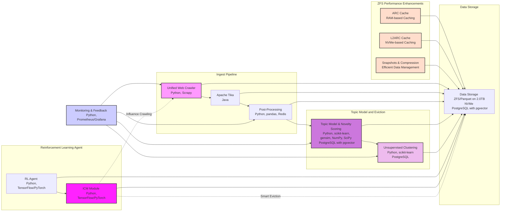

To reflect that the Reinforcement Learning Agent/ICM components, data ingest pipeline, and topic modeling modules are running on the same NVMe drive, we need to modify the Mermaid diagram to show that all these components share the same data storage. Additionally, we should consider potential bottlenecks and provide rough estimates for the I/O performance.

Here’s the refactored Mermaid diagram:

### Explanation of Potential Bottlenecks and Performance Estimates

#### I/O Performance Estimates for the SAMSUNG SSD 990 PRO 2TB

1. **Sequential Read/Write Speeds:**
   - **Read:** Up to 7,450 MB/s
   - **Write:** Up to 6,900 MB/s

2. **Random Read/Write IOPS:**
   - **Random Read (4KB, QD32):** Up to 1,400,000 IOPS
   - **Random Write (4KB, QD32):** Up to 1,550,000 IOPS

#### Potential Bottlenecks and Mitigation

1. **Concurrent Access:**
   - Since multiple components will access the NVMe drive concurrently, random IOPS performance is critical.
   - **Mitigation:** Utilize ZFS’s ARC and L2ARC to cache frequently accessed data in RAM and on the NVMe drive itself, reducing direct read/write operations to the storage.

2. **Write Intensive Operations:**
   - Components like the RL Agent and ICM Module might generate significant write load, which can affect performance.
   - **Mitigation:** Use ZFS’s ZIL (ZFS Intent Log) to handle write operations efficiently. Ensure ZFS configurations are optimized for high write performance.

3. **Read-Write Conflicts:**
   - High read and write operations can lead to conflicts and reduced performance.
   - **Mitigation:** Properly configure ZFS with separate datasets and caching strategies to isolate I/O workloads as much as possible.

4. **RAM Utilization:**
   - Ensuring enough RAM is allocated for ARC to cache active working sets.
   - **Mitigation:** Given your hardware has 128GB of RAM, allocate a substantial portion to ARC (e.g., 64GB) and configure L2ARC to further extend the cache.

### Rough Performance Estimates for Each Component

- **Ingest Pipeline:**
  - **Read/Write Speed:** Since this involves reading and parsing data, sequential read speeds will be beneficial. Expect close to the maximum sequential read speeds (up to 7,450 MB/s) for large files.
  - **Random IOPS:** Important for handling many small files and operations concurrently. The NVMe drive’s high IOPS will significantly benefit this component.

- **Topic Model and Eviction:**
  - **Read/Write Speed:** High read speeds will help in processing and model training, with write speeds benefiting intermediate results storage.
  - **Random IOPS:** High IOPS will help in accessing database records efficiently.

- **Reinforcement Learning Agent:**
  - **Read/Write Speed:** Model training can benefit from high sequential read/write speeds. 
  - **Random IOPS:** Random read/write operations for model parameters and training data will be supported well by the NVMe drive’s high IOPS.

- **Monitoring & Feedback:**
  - **Read/Write Speed:** Moderate read/write speeds needed for logging and monitoring data.
  - **Random IOPS:** High IOPS will ensure quick access to monitoring data and logs.

By incorporating these considerations and configuring the ZFS caching mechanisms appropriately, you can optimize the performance and mitigate potential bottlenecks in your system ensemble.
