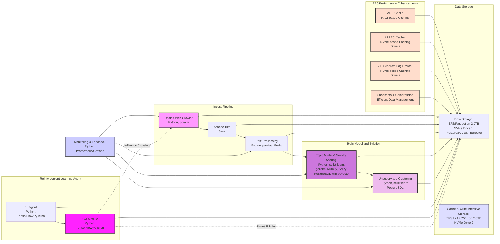

To maximize the performance of your system ensemble with two identical NVMe drives, you can distribute the workload across the drives and configure ZFS to take advantage of the additional storage and I/O capabilities. Here’s how you can refactor the proposed ensemble:

1. **Separate Data Storage and Caching:**
   - Use one NVMe drive primarily for data storage (main datasets, databases).
   - Use the second NVMe drive for caching (L2ARC, ZIL) and possibly for write-heavy tasks.

2. **Distribute the Workload:**
   - Assign different components to different drives to balance I/O loads.

Here's the updated Mermaid diagram reflecting these changes:



### Explanation of Changes:

1. **Separate Data Storage and Caching:**
   - **H1 (Data Storage on Drive 1):** This NVMe drive is dedicated to storing the main datasets, databases, and primary data used by all components.
   - **H2 (Cache & Write-Intensive Storage on Drive 2):** This NVMe drive is used for ZFS caching (L2ARC) and ZIL, enhancing write performance and reducing read latency.

2. **ZFS Performance Enhancements:**
   - **ARC Cache:** Utilize the system RAM for ARC caching, optimizing frequently accessed data.
   - **L2ARC Cache:** Configure the second NVMe drive as the L2ARC to offload less frequently accessed data from ARC.
   - **ZIL (Separate Log Device):** Use the second NVMe drive as a dedicated ZIL device to handle write operations efficiently.
   - **Snapshots & Compression:** Continue using ZFS features like snapshots and compression to manage data efficiently.

### Implementation Steps:

1. **Set Up ZFS Pools:**
   - Create a ZFS pool on the first NVMe drive for data storage:
     ```sh
     sudo zpool create tank1 /dev/nvme0n1
     sudo zfs create tank1/data
     sudo zfs set mountpoint=/mnt/data tank1/data
     ```

   - Create a ZFS pool on the second NVMe drive for caching and write-intensive tasks:
     ```sh
     sudo zpool create tank2 /dev/nvme1n1
     sudo zpool add tank1 cache /dev/nvme1n1
     sudo zpool add tank1 log /dev/nvme1n1
     ```

2. **Configure ZFS ARC:**
   - Allocate a substantial portion of RAM for ARC caching:
     ```sh
     echo "options zfs zfs_arc_max=68719476736" | sudo tee /etc/modprobe.d/zfs.conf
     sudo update-initramfs -u
     ```

3. **Configure L2ARC:**
   - Tune L2ARC parameters for optimal performance:
     ```sh
     echo "options zfs zfs_l2arc_write_max=8388608" | sudo tee -a /etc/modprobe.d/zfs.conf
     echo "options zfs zfs_l2arc_write_boost=16777216" | sudo tee -a /etc/modprobe.d/zfs.conf
     echo "options zfs zfs_l2arc_noprefetch=0" | sudo tee -a /etc/modprobe.d/zfs.conf
     sudo update-initramfs -u
     ```

### Rough Performance Estimates

With the separation of data storage and caching, you can expect:

- **Ingest Pipeline:** Improved performance due to reduced read/write contention.
- **Topic Model and Eviction:** Enhanced I/O performance from distributed read and write operations.
- **Reinforcement Learning Agent:** Faster model training and data access due to efficient caching and reduced I/O bottlenecks.
- **Overall System:** Improved responsiveness and reduced latency from efficient use of system RAM (ARC) and NVMe-based caching (L2ARC and ZIL).

By distributing the workload and leveraging the caching capabilities of ZFS, you can maximize the performance of your components and fully utilize the potential of your two NVMe drives.


DeepSeekV2

To maximize the performance of your ensemble with two identical NVMe drives, you can leverage ZFS's capabilities to create a mirrored pool (RAID 1 equivalent) or a striped pool (RAID 0 equivalent). Here's a refactored approach to maximize performance:

### 1. Create a Mirrored ZFS Pool

Creating a mirrored pool will provide redundancy and improve read performance by allowing ZFS to read from both drives simultaneously.

```bash
sudo zpool create datapool mirror /dev/nvme0n1 /dev/nvme1n1
```

### 2. Add L2ARC and SLOG Devices

Since you have two NVMe drives, you can dedicate one drive to L2ARC and the other to SLOG. This will further enhance performance by offloading read and write caching from the main pool.

#### Add L2ARC:

```bash
sudo zpool add datapool cache /dev/nvme0n1
```

#### Add SLOG:

```bash
sudo zpool add datapool log /dev/nvme1n1
```

### 3. Optimize ARC Size

Given your system's large RAM capacity, you can allocate a significant portion of it to the ARC to improve read performance.

```bash
sudo sysctl -w kstat.zfs.darwin.arc_max=68719476736  # Set ARC max to 64GB
```

To make this change permanent, add the following line to `/etc/sysctl.conf`:

```bash
kstat.zfs.darwin.arc_max=68719476736
```

### 4. Enable Compression and Deduplication

Enabling compression can improve storage efficiency and potentially enhance performance by reducing the amount of data that needs to be read or written. Deduplication can also save space, but it can be resource-intensive.

```bash
sudo zfs set compression=on datapool
```

### 5. Create Datasets for Different Components

Create datasets within the pool for different components of your ensemble to organize your data effectively.

```bash
sudo zfs create datapool/ingest
sudo zfs create datapool/topic_model
sudo zfs create datapool/rl_agent
sudo zfs create datapool/monitoring
```

### 6. Set Mount Points (Optional)

You can set specific mount points for each dataset if needed.

```bash
sudo zfs set mountpoint=/data/ingest datapool/ingest
sudo zfs set mountpoint=/data/topic_model datapool/topic_model
sudo zfs set mountpoint=/data/rl_agent datapool/rl_agent
sudo zfs set mountpoint=/data/monitoring datapool/monitoring
```

### 7. Monitor and Tune

Use ZFS monitoring tools like `zpool iostat`, `arcstat`, and `zfs list` to monitor the performance of your pool and datasets. Adjust the ARC size, L2ARC, and SLOG configurations based on your workload's access patterns.

### Example Output

```bash
NAME                   USED  AVAIL     REFER  MOUNTPOINT
datapool              96.5K  1.81T     24.5K  /datapool
datapool/ingest         24K  1.81T       24K  /data/ingest
datapool/topic_model    24K  1.81T       24K  /data/topic_model
datapool/rl_agent       24K  1.81T       24K  /data/rl_agent
datapool/monitoring     24K  1.81T       24K  /data/monitoring
```

By following these steps, you can maximize the performance of your ensemble by leveraging the capabilities of ZFS and your two NVMe drives. This setup will provide redundancy, improve read and write performance, and ensure efficient use of your storage resources.
